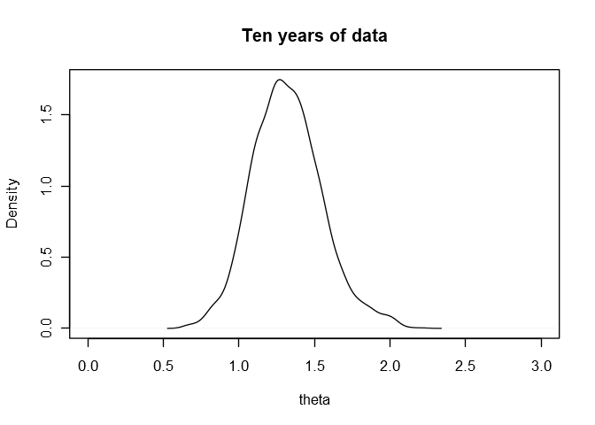
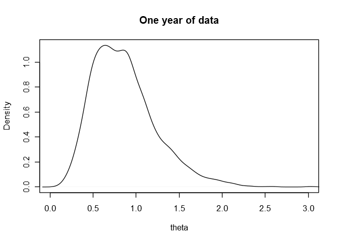
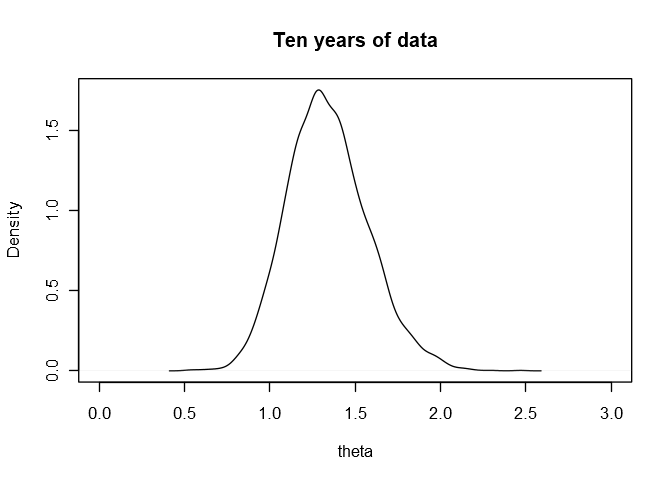
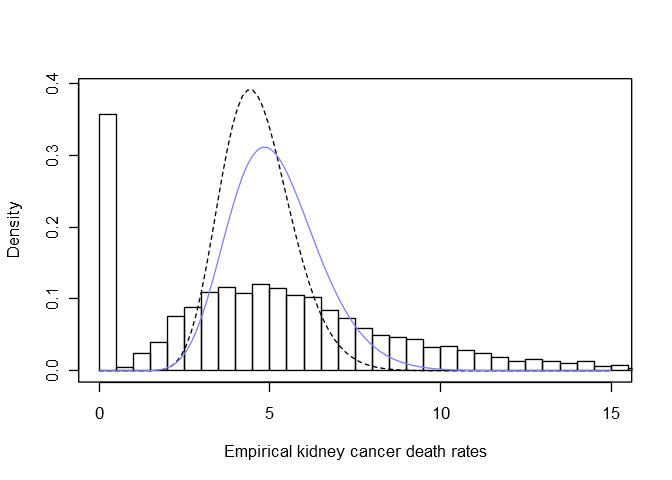
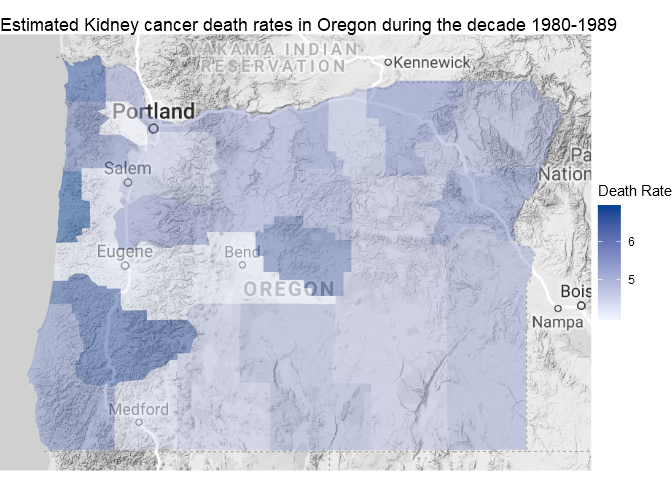

Chapter 2: Single-parameter models
================

Libraries for models and helper functions for plots:

``` r
library(brms)
library(tools)

col.alpha <- function( acol , alpha=0.2 ) {
    acol <- col2rgb(acol)
    acol <- rgb(acol[1]/255,acol[2]/255,acol[3]/255,alpha)
    acol
}

col.desat <- function( acol , amt=0.5 ) {
    acol <- col2rgb(acol)
    ahsv <- rgb2hsv(acol)
    ahsv[2] <- ahsv[2] * amt
    hsv( ahsv[1] , ahsv[2] , ahsv[3] )
}

rangi2 <- col.desat("blue", 0.5)
```

# 2.1 Estimating a probability from binomial data

## Historical note: Bayes and Laplace

> \[Laplace’s\] first serious application was to estimate the proportion
> of girl births in a population. A total of 241,945 girls and 251,527
> boys were born in Paris from 1745 to 1770. Letting theta be the
> probability that any birth is female, Laplace showed that

> **Pr(theta \>= 0.5 | y = 241945, n = 251527+241945) ~ 1.15 \*
> 10^(-42),**

> and so he was ‘morally certain’ that **theta \< 0.5**.

``` r
pbeta(0.5, 241945+1, 251527+1, lower.tail = FALSE)
```

    ## [1] 1.146058e-42

# 2.6 Other standard single-parameter models

## Estimating a rate from Poisson data: an idealized example

If we hadn’t done the math to find the posterior analytically, we could
still get the same mean and posterior samples using **brms**. The
following model estimates theta in the formula **y ~
Poisson(theta\*x)**. Note that we need to specify that **brms** should
use an identity link function, since otherwise it will default to a log
link.

``` r
m2_1 <- brm(
    y ~ 0 + x,
    family = poisson("identity"),
    prior = prior(gamma(3,5)),
    data = list(y = 3, x = 2),
    control = list(adapt_delta = 0.999)
)
```

``` r
summary(m2_1)
```

    ##  Family: poisson 
    ##   Links: mu = identity 
    ## Formula: y ~ 0 + x 
    ##    Data: list(y = 3, x = 2) (Number of observations: 1) 
    ## Samples: 4 chains, each with iter = 2000; warmup = 1000; thin = 1;
    ##          total post-warmup samples = 4000
    ## 
    ## Population-Level Effects: 
    ##   Estimate Est.Error l-95% CI u-95% CI Eff.Sample Rhat
    ## x     0.86      0.34     0.34     1.64        919 1.00
    ## 
    ## Samples were drawn using sampling(NUTS). For each parameter, Eff.Sample 
    ## is a crude measure of effective sample size, and Rhat is the potential 
    ## scale reduction factor on split chains (at convergence, Rhat = 1).

As expected, the posterior mean for theta is roughly 0.86. We can
re-create Figure 2.5 using the posterior samples:

``` r
theta <- as.data.frame(m2_1)$b_x
plot(density(theta), xlim = c(0, 3), xlab = "theta", main = "One year of data")
```

<!-- -->

To fit the model to the new 10-year data, we can just pass it to the
last model with `update()`. This avoids recompiling anything.

``` r
m2_2 <- update(m2_1, newdata = list(y = 30, x = 20))
```

``` r
summary(m2_2)
```

    ##  Family: poisson 
    ##   Links: mu = identity 
    ## Formula: y ~ 0 + x 
    ##    Data: list(y = 30, x = 20) (Number of observations: 1) 
    ## Samples: 4 chains, each with iter = 2000; warmup = 1000; thin = 1;
    ##          total post-warmup samples = 4000
    ## 
    ## Population-Level Effects: 
    ##   Estimate Est.Error l-95% CI u-95% CI Eff.Sample Rhat
    ## x     1.32      0.23     0.89     1.83        919 1.01
    ## 
    ## Samples were drawn using sampling(NUTS). For each parameter, Eff.Sample 
    ## is a crude measure of effective sample size, and Rhat is the potential 
    ## scale reduction factor on split chains (at convergence, Rhat = 1).

``` r
theta <- as.data.frame(m2_2)$b_x
plot(density(theta), xlim = c(0, 3), xlab = "theta", main = "Ten years of data")
```

<!-- -->

``` r
# probability that theta > 1
sum(theta > 1) / length(theta)
```

    ## [1] 0.93075

### Fitting the model on the log scale

Often it’s more natural to fit Poisson means on a log scale, especially
if you want to include predictors. For this problem, the model on the
log scale (that is, using a log link function) looks like

  - **y ~ Poisson(lambda)**
  - **log(lambda) = phi + log(x)**

and our goal is to estimate phi. We can then retrieve theta using the
relationship **theta = exp(phi)**.

Now we have to specify a prior for phi. Here’s what Gelman’s gamma(3,5)
prior for theta looks like on the log scale:

``` r
curve(dgamma(exp(x), 3, 5)*exp(x), from = -4, to = 1, ylim = c(0, 0.8))
```

<!-- -->

With **brms** there’s no need to restrict ourselves to a conjugate
prior, so there are many acceptable priors we could use instead.
Reasonable options would be a normal density with the same mean and
variance as this, or even a skew-normal density.

The mean and standard deviation of Gelman’s prior on the log scale
are:

``` r
mu <- integrate(function(x) x*dgamma(exp(x), 3, 5)*exp(x), lower = -20, upper = 10)$value
sigma <- sqrt(integrate(function(x) x^2*dgamma(exp(x), 3, 5)*exp(x), lower = -20, upper = 10)$value - mu^2)
data.frame(mean = mu, sd = sigma)
```

    ##         mean        sd
    ## 1 -0.6866536 0.6284378

Here’s a plot of the normal with these parameters (dashed), and the
skew-normal with skew -2.1 (blue), against Gelman’s prior.

``` r
curve(dgamma(exp(x), 3, 5)*exp(x), from = -4, to = 1, ylim = c(0, 0.8))
curve(dnorm(x, mu, sigma), lty = 2, add = TRUE)
curve(dskew_normal(x, mu, sigma, alpha =  -2.1), col = rangi2, add = TRUE)
```

<!-- -->

We’ll choose the skew-normal to capture the skewness of Gelman’s
original prior. Since Stan uses a different parameterization (see
[vignette(“brms\_families”)](https://cran.r-project.org/web/packages/brms/vignettes/brms_families.html)),
we need to transform mu and sigma into xi and omega:

``` r
alpha <- -2.1
omega <- sigma/sqrt(1 - 2*alpha^2/(pi*(1+alpha^2)))
xi <- mu - omega*alpha*sqrt(2/pi)/sqrt(1+alpha^2)
data.frame(xi = xi, omega = omega, alpha = alpha)
```

    ##            xi     omega alpha
    ## 1 -0.03393538 0.9060768  -2.1

Now we fit the model using **brms**. Note that the exposure x = 2 is
passed using the `offset()` command.

``` r
## Requires brms version >=2.6.1.
## Ref: https://github.com/paul-buerkner/brms/issues/545
m2_3 <- brm(
    y ~ offset(log(x)),
    family = poisson("log"),
    prior = prior(skew_normal(-0.0339, 0.906, -2.1), class = Intercept),
    data = list(y = 3, x = 2)
)
```

``` r
summary(m2_3)
```

    ##  Family: poisson 
    ##   Links: mu = log 
    ## Formula: y ~ offset(log(x)) 
    ##    Data: list(y = 3, x = 2) (Number of observations: 1) 
    ## Samples: 4 chains, each with iter = 2000; warmup = 1000; thin = 1;
    ##          total post-warmup samples = 4000
    ## 
    ## Population-Level Effects: 
    ##           Estimate Est.Error l-95% CI u-95% CI Eff.Sample Rhat
    ## Intercept    -0.24      0.44    -1.17     0.56       1199 1.00
    ## 
    ## Samples were drawn using sampling(NUTS). For each parameter, Eff.Sample 
    ## is a crude measure of effective sample size, and Rhat is the potential 
    ## scale reduction factor on split chains (at convergence, Rhat = 1).

And we retrieve theta by exponentiating the intercept phi:

``` r
theta <- exp(as.data.frame(m2_3)$b_Intercept)
mean(theta)
```

    ## [1] 0.8629854

``` r
plot(density(theta), xlim = c(0, 3), xlab = "theta", main = "One year of data")
```

<!-- -->

This is essentially the same mean and posterior density that we got
earlier. For ten years of data:

``` r
m2_4 <- update(m2_3, newdata = list(y = 30, x = 20))
```

``` r
summary(m2_4)
```

    ##  Family: poisson 
    ##   Links: mu = log 
    ## Formula: y ~ offset(log(x)) 
    ##    Data: list(y = 30, x = 20) (Number of observations: 1) 
    ## Samples: 4 chains, each with iter = 2000; warmup = 1000; thin = 1;
    ##          total post-warmup samples = 4000
    ## 
    ## Population-Level Effects: 
    ##           Estimate Est.Error l-95% CI u-95% CI Eff.Sample Rhat
    ## Intercept     0.28      0.18    -0.09     0.61       1485 1.00
    ## 
    ## Samples were drawn using sampling(NUTS). For each parameter, Eff.Sample 
    ## is a crude measure of effective sample size, and Rhat is the potential 
    ## scale reduction factor on split chains (at convergence, Rhat = 1).

``` r
theta <- exp(as.data.frame(m2_4)$b_Intercept)
mean(theta)
```

    ## [1] 1.339728

``` r
plot(density(theta), xlim = c(0, 3), xlab = "theta", main = "Ten years of data")
```

<!-- -->

``` r
# probability that theta > 1
sum(theta > 1) / length(theta)
```

    ## [1] 0.93625

#### Was all that really necessary?

One immediate benefit of fitting the model using the log link is that
sampling was MUCH more efficient and didn’t require crazy `adapt_delta`
values to get rid of divergent transitions.

We put in some extra effort to match Gelman’s prior as best we could. In
practice we would have looked at the available past data on the log
scale from the start, and picked a prior based on that. This has the
added benefit of being able to plug the appropriate mean and standard
deviation directly into a skew-normal density rather than needing to
play around with the parameters of the gamma distribution.

# 2.7 Example: Informative prior distribution for cancer ratios

Gelman provides data for this example on his website for the book, but R
had some trouble reading it directly because of double-tabbed separators
in some rows and sporadic typos (rogue ‘.’ characters instead of tabs,
spelling counties and states(\!) differently between the two files,
etc.). So I cleaned up the data a bit and included it in the
“/cancerdata/” folder of this Github repository.

I believe these files contain the age-adjusted deaths and populations
for these counties in the years 1980-1984 and 1985-1989. Consequently,
each county will have at most two rows in the combined data. We will use
these two data points to get a single estimate for the true death rate
for this type of cancer in this county the decade 1980-1989.

Here’s our process to prep the data for analysis:

  - Load the two files with `read.delim` and combine them into a single
    data frame.
  - Remove empty rows and rows for counties with 0 population.
  - Replace periods with spaces in state and county names.
  - Convert state and county names to lowercase to get rid of
    capitalization irregularities.
  - Create a new column called `state_county` which combines the state
    names and counties to serve as a unique identifier for each county
    in the country.

<!-- end list -->

``` r
d1 <- read.delim("gd80to84.txt")
d2 <- read.delim("gd85to89.txt")
cancer <- rbind(d1, d2)
cancer <- cancer[!is.na(cancer$state) & cancer$pop > 0,]
cancer$state <- as.factor(tolower(gsub(".", " ", cancer$state, fixed = TRUE)))
cancer$county <- as.factor(tolower(gsub(".", " ", cancer$county, fixed = TRUE)))
cancer$state_county <- paste(cancer$state, "-", cancer$county)
cancer$state_county <- as.factor(cancer$state_county)
nrow(cancer)
```

    ## [1] 6228

And here are the first few rows of the
    data:

``` r
head(cancer)
```

    ##     state  county dc   dcV    pop  popV aadc      aadcV dcC       dcCV
    ## 1 alabama autauga  2 VALID  61921 VALID  3.3 UNRELIABLE 3.2 UNRELIABLE
    ## 2 alabama baldwin  7 VALID 170945 VALID  3.5 UNRELIABLE 4.1 UNRELIABLE
    ## 3 alabama barbour  0 VALID  33316 VALID  0.0 UNRELIABLE 0.0 UNRELIABLE
    ## 4 alabama    bibb  0 VALID  30152 VALID  0.0 UNRELIABLE 0.0 UNRELIABLE
    ## 5 alabama  blount  3 VALID  88342 VALID  3.2 UNRELIABLE 3.4 UNRELIABLE
    ## 6 alabama bullock  0 VALID   8313 VALID  0.0 UNRELIABLE 0.0 UNRELIABLE
    ##   good      state_county
    ## 1    1 alabama - autauga
    ## 2    1 alabama - baldwin
    ## 3    1 alabama - barbour
    ## 4    1    alabama - bibb
    ## 5    1  alabama - blount
    ## 6    1 alabama - bullock

If I understand correctly, the column **dc** contains the number of
deaths, and the column **dcC** contains the death rates per 100,000
people. You can check that **dc**\*1e5/**pop** = **dcC**.

Gelman suggests using a gamma(20, 430000) prior. Let’s plot this over
the density of positive death rates in the data.

``` r
plot(
    density(cancer[cancer$dc > 0,]$dcC, adj = 0.5),
    ylim = c(0, 0.4), xlim = c(0, 25),
    xlab = "Kidney cancer death rates (per 100,000 per year)", ylab = "Density of counties", main = ""
)

curve(dgamma(x, 20, 4.3), lty = 2, add = TRUE)  # 4.3 instead of 430,000 since death rates are per 100,000
```

<!-- -->

## Models

Somewhat contrary to the spirit of this singalong, we’ll switch over to
the [**rethinking** package](https://github.com/rmcelreath/rethinking)
for the remainder of the chapter. Throughout the following I’ll comment
on what was difficult (or impossible) to do with **brms**.

``` r
unloadNamespace("brms")
library(rethinking)
```

Let’s make a data frame containing just the columns from the cancer data
that we’ll use to fit the models. To make the numbers a little easier to
work with we’ll divide the populations by 100,000. Then the thetas we
estimate will be death rates per 100,000.

``` r
d <- data.frame(
    y = cancer$dc,
    n = cancer$pop * 1e-5,
    state_county = cancer$state_county
)
head(d)
```

    ##   y       n      state_county
    ## 1 2 0.61921 alabama - autauga
    ## 2 7 1.70945 alabama - baldwin
    ## 3 0 0.33316 alabama - barbour
    ## 4 0 0.30152    alabama - bibb
    ## 5 3 0.88342  alabama - blount
    ## 6 0 0.08313 alabama - bullock

### Using Gelman’s prior

To start, we’ll just compute the adjusted estimates for the first 20
counties in the data using Gelman’s gamma(20, 4.3) prior. Here’s what
this prior looks like against a histogram of these 20 empirical death
rates:

``` r
curve(dgamma(x, 20, 4.3), lty = 2, from = 0, to = 15)
hist((d$y/d$n)[1:20], breaks = 10, probability = TRUE, add = TRUE)
```

<!-- -->

Defining the model in **rethinking** looks a bit different than the
models in **brms**. We specify the Poisson likelihood with `y ~
dpois(lambda)`, and specify the formula **lambda = theta\[j\]\*n\[j\]**
below it, indicating that we want to estimate a different theta for each
county with `theta[state_county]`. We then set the gamma(20, 4.3) prior
on all of these thetas.

``` r
m2_5 <- map2stan(
    alist(
        y ~ dpois(lambda),
        lambda <- theta[state_county]*n,
        theta[state_county] ~ dgamma(20, 4.3)
    ),
    data = d[1:20,],
    start = list(theta = rep(4, 20)),
    chains = 4,
    cores = 4
)
```

``` r
precis(m2_5, depth = 2)
```

    ##           Mean StdDev lower 0.89 upper 0.89 n_eff Rhat
    ## theta[1]  4.48   0.93       2.91       5.86  5584    1
    ## theta[2]  4.49   0.85       3.09       5.79  6229    1
    ## theta[3]  4.33   0.97       2.72       5.71  5056    1
    ## theta[4]  4.36   0.97       2.79       5.83  5325    1
    ## theta[5]  4.42   0.91       2.98       5.77  5302    1
    ## theta[6]  4.55   1.00       3.05       6.22  6009    1
    ## theta[7]  4.32   0.96       2.85       5.82  5229    1
    ## theta[8]  4.30   0.78       3.00       5.45  5775    1
    ## theta[9]  5.49   1.07       3.75       7.10  5118    1
    ## theta[10] 4.23   0.94       2.68       5.65  5454    1
    ## theta[11] 4.44   0.94       3.05       5.92  4166    1
    ## theta[12] 4.65   1.00       3.08       6.25  5028    1
    ## theta[13] 4.48   1.00       2.83       5.93  5389    1
    ## theta[14] 5.03   1.03       3.40       6.64  6013    1
    ## theta[15] 4.81   1.04       3.14       6.41  4536    1
    ## theta[16] 4.52   0.95       3.03       6.05  5371    1
    ## theta[17] 4.27   0.90       2.81       5.63  5020    1
    ## theta[18] 4.85   1.04       3.26       6.50  5299    1
    ## theta[19] 4.92   1.07       3.23       6.58  5201    1
    ## theta[20] 4.74   0.96       3.17       6.16  5598    1

I wasn’t able to figure out an easy way to fit this model in **brms**.
But, if we wanted, we could fit the model on a log scale with a
skew-normal prior that approximates the transformed gamma prior.

### Estimating the prior from the data

As Gelman notes, the approach of estimating the parameters of the prior
by matching moments with the distribution of the data is difficult to
generalize and is really only feasible when using conjugate priors.

One great aspect of **rethinking** is that we can estimate the
parameters of our prior at the same time that we estimate the thetas.
Instead of the usual gamma distribution, we’ll use a re-parameterization
of it from **rethinking** called gamma2, which is defined by

**gamma2(mean, scale) = gamma(shape = mean/scale, rate = 1/scale)**

Estimating the mean and the scale turns out to be much more numerically
stable than estimating the shape and the rate. Here’s our model:

``` r
m2_6 <- map2stan(
    alist(
        y ~ dpois(lambda),
        lambda <- theta[state_county]*n,
        theta[state_county] ~ dgamma2(mu, scale),
        mu ~ dnorm(5, 0.5),
        scale ~ dgamma(2, 6)
    ),
    data = d,
    start = list(theta = rep(5, nlevels(d$state_county))),  # tells Stan how many counties there are
    constraints = list(mu = "lower=0"),  # mu can only be positive
    control = list(max_treedepth = 15),
    iter = 3e3,
    warmup = 1e3,
    chains = 4,
    cores = 4
)
```

This model took about half an hour to sample on my laptop. According to
the author of **brms**, [it’s impossible to fit this model using
**brms**](https://discourse.mc-stan.org/t/adaptive-priors-other-than-gaussians-for-group-level-effects/6425).
For the priors of grouped parameters (like theta in this model),
**brms** only uses Gaussian distributions. Of course this is extremely
useful when you have multiple parameters with the same groups because
it’s then possible to model correlations between the parameters (using
multivariate Gaussians). But for weird little models like this one,
where the whole point is to fit the data using an adaptive gamma prior,
we’re better off using **rethinking**.

Anyway, here are the estimated mean and scale parameters for our gamma
prior.

``` r
precis(m2_6)
```

    ## 3114 vector or matrix parameters omitted in display. Use depth=2 to show them.

    ##       Mean StdDev lower 0.89 upper 0.89 n_eff Rhat
    ## mu    5.18   0.04       5.11       5.25  3390    1
    ## scale 0.33   0.02       0.30       0.37  1052    1

Let’s plot this prior (blue), as well as Gelman’s gamma(20, 4.3) prior
(dashed), over the histogram of empirical death rates.

``` r
coefs <- coef(m2_6)
curve(
    dgamma(x, 20, 4.3),
    from = 0, to = 15,
    lty = 2,
    xlab = "Empirical kidney cancer death rates", ylab = "Density"
)
hist(d$y/d$n, breaks = 250, probability = TRUE, add = TRUE)
curve(dgamma2(x, coefs["mu"], coefs["scale"]), col = rangi2, add = TRUE)
```

<!-- -->

### Results

First we’ll make a data frame containing our estimates along with their
corresponding state, county, and state abbreviation.

``` r
estimates <- data.frame(
    value = coefs[1:nlevels(cancer$state_county)],
    state = sapply(
        1:nlevels(cancer$state_county),
        function(i) cancer[cancer$state_county == levels(cancer$state_county)[i],][1, "state"]
    ),
    county = sapply(
        1:nlevels(cancer$state_county),
        function(i) cancer[cancer$state_county == levels(cancer$state_county)[i],][1, "county"]
    )
)
estimates$stateabbr <- sapply(
    as.character(estimates$state),
    function(s) ifelse(s == "District of Columbia", "DC", state.abb[grep(toTitleCase(s), state.name)][1])
)
rownames(estimates) <- NULL
```

Here are the fifty counties with the lowest estimated death rates.

``` r
estimates[order(estimates$value),][1:50,]
```

    ##         value          state         county stateabbr
    ## 68   2.380890         alaska         alaska        AK
    ## 2764 2.387657           utah      salt lake        UT
    ## 2771 2.419882           utah           utah        UT
    ## 218  2.488825       colorado       arapahoe        CO
    ## 2600 2.598890          texas        hidalgo        TX
    ## 235  2.710084       colorado        el paso        CO
    ## 2749 2.850440           utah          cache        UT
    ## 2662 2.899442          texas     montgomery        TX
    ## 2752 2.930295           utah          davis        UT
    ## 390  3.008552        georgia           cobb        GA
    ## 1926 3.040430 north carolina         onslow        NC
    ## 1885 3.047140 north carolina     cumberland        NC
    ## 1544 3.059087       missouri  saint charles        MO
    ## 1233 3.076637       michigan         ingham        MI
    ## 2829 3.091341       virginia        fairfax        VA
    ## 2892 3.106357       virginia prince william        VA
    ## 1281 3.107841       michigan      washtenaw        MI
    ## 2593 3.120534          texas         harris        TX
    ## 245  3.138034       colorado      jefferson        CO
    ## 2114 3.167382       oklahoma      cleveland        OK
    ## 1356 3.213054      minnesota        stearns        MN
    ## 1951 3.254962 north carolina           wake        NC
    ## 291  3.259448        florida        alachua        FL
    ## 518  3.289981         hawaii       honolulu        HI
    ## 349  3.301675        florida       seminole        FL
    ## 2512 3.327125          texas       brazoria        TX
    ## 2542 3.351336          texas        coryell        TX
    ## 2523 3.353447          texas        cameron        TX
    ## 327  3.367092        florida           leon        FL
    ## 1784 3.367944     new mexico          otero        NM
    ## 1843 3.461998       new york       saratoga        NY
    ## 2673 3.475335          texas         orange        TX
    ## 1537 3.501535       missouri        pulaski        MO
    ## 1114 3.508061      louisiana     livingston        LA
    ## 1285 3.526100      minnesota          anoka        MN
    ## 719  3.538317        indiana         monroe        IN
    ## 2809 3.544752       virginia       campbell        VA
    ## 977  3.550347       kentucky        bullitt        KY
    ## 2916 3.551434       virginia virginia beach        VA
    ## 205  3.554940     california         solano        CA
    ## 184  3.558843     california       monterey        CA
    ## 59   3.592491        alabama         shelby        AL
    ## 3110 3.596371        wyoming     sweetwater        WY
    ## 1772 3.599837     new mexico       dona ana        NM
    ## 1302 3.602799      minnesota         dakota        MN
    ## 2719 3.606009          texas         travis        TX
    ## 71   3.613572        arizona       coconino        AZ
    ## 287  3.613633       delaware           kent        DE
    ## 446  3.618406        georgia        liberty        GA
    ## 424  3.622058        georgia       gwinnett        GA

And here are the fifty counties with the highest estimated death rates.

``` r
estimates[order(estimates$value, decreasing = TRUE),][1:50,]
```

    ##         value          state     county stateabbr
    ## 348  9.963069        florida   sarasota        FL
    ## 341  9.125849        florida      pasco        FL
    ## 298  8.803990        florida  charlotte        FL
    ## 342  8.601806        florida   pinellas        FL
    ## 296  8.575647        florida    broward        FL
    ## 340  8.406054        florida palm beach        FL
    ## 299  8.255086        florida     citrus        FL
    ## 2257 7.825722   pennsylvania    mifflin        PA
    ## 1489 7.821535       missouri  gasconade        MO
    ## 326  7.731962        florida        lee        FL
    ## 953  7.730731         kansas     sumner        KS
    ## 2248 7.709572   pennsylvania lackawanna        PA
    ## 577  7.665469       illinois       clay        IL
    ## 174  7.650118     california       lake        CA
    ## 282  7.630024    connecticut  middlesex        CT
    ## 1118 7.626654      louisiana    orleans        LA
    ## 613  7.618988       illinois   la salle        IL
    ## 935  7.582594         kansas       reno        KS
    ## 2581 7.534897          texas   gonzales        TX
    ## 301  7.522798        florida    collier        FL
    ## 1759 7.476670     new jersey      ocean        NJ
    ## 3035 7.444932      wisconsin    douglas        WI
    ## 1041 7.386049       kentucky  mccracken        KY
    ## 185  7.340032     california       napa        CA
    ## 1339 7.328554      minnesota otter tail        MN
    ## 1332 7.313638      minnesota   morrison        MN
    ## 333  7.302995        florida     martin        FL
    ## 1314 7.278100      minnesota     itasca        MN
    ## 3089 7.264737      wisconsin   waushara        WI
    ## 937  7.242702         kansas       rice        KS
    ## 734  7.234760        indiana   randolph        IN
    ## 317  7.218830        florida   hernando        FL
    ## 81   7.218170        arizona    yavapai        AZ
    ## 2437 7.211147      tennessee      henry        TN
    ## 570  7.202739       illinois     bureau        IL
    ## 632  7.194711       illinois montgomery        IL
    ## 2500 7.178051          texas     austin        TX
    ## 572  7.139250       illinois    carroll        IL
    ## 76   7.122919        arizona     mohave        AZ
    ## 1459 7.111582       missouri      bates        MO
    ## 108  7.097516       arkansas    garland        AR
    ## 1912 7.091797 north carolina        lee        NC
    ## 2169 7.078732       oklahoma   stephens        OK
    ## 2147 7.046921       oklahoma    mcclain        OK
    ## 1813 7.045471       new york      essex        NY
    ## 73   7.039105        arizona     graham        AZ
    ## 1187 7.033720  massachusetts barnstable        MA
    ## 62   7.007257        alabama tallapoosa        AL
    ## 1904 6.993903 north carolina  henderson        NC
    ## 2731 6.978775          texas washington        TX

I’d like to make a map similar to the ones in the book. To do so we need
the FIPS codes for each of the counties in the data. These can be
downloaded from the [US Census
Bureau](https://www.census.gov/geo/reference/codes/cou.html). But to
make them match the county names in our data I had to make quite a few
small modifications. I’ve included the modified file “fips.txt” in the
“/cancerdata/” folder of this repository.

``` r
fips <- read.delim("fips.txt")
fips$county <- tolower(fips$county)
estimates <- merge(estimates, fips)
head(estimates)
```

    ##      county stateabbr    value          state region
    ## 1 abbeville        SC 6.801611 south carolina  45001
    ## 2    acadia        LA 6.709860      louisiana  22001
    ## 3  accomack        VA 6.452472       virginia  51001
    ## 4       ada        ID 4.380238          idaho  16001
    ## 5     adair        IA 5.391763           iowa  19001
    ## 6     adair        KY 4.945473       kentucky  21001

Now we have a new column containing the unique FIPS code for each
county. A mapping package like **choroplethr** can take these codes and
create some beautiful maps from our data.

``` r
library(choroplethr)
```

Here is a map coloring each county along a continuous gradient according
to its estimated death rate. Darker counties had higher estimated death
rates.

``` r
county_choropleth(
    estimates,
    num_colors = 1,
    title = "Estimated kidney cancer death rates during the decade 1980-1989",
    legend = "Death Rate"
)
```

<!-- -->

We can also bin the counties. I’m not sure how choropleth picks these
bin widths (by standard deviations? by number of counties in each
range?). Here we chose a different color scheme, with yellow counties
having the lowest death rates and red counties having the highest.

``` r
choro <- CountyChoropleth$new(estimates)
choro$title <- "Estimated kidney cancer death rates during the decade 1980-1989"
choro$ggplot_scale <- scale_fill_brewer(name = "Death Rate", palette = "YlOrRd")
choro$render()
```

<!-- -->

I’m now living in Oregon, and I wanted to see what the death rates here
look like. I’ll overlay it on a map with some city names for reference.

``` r
# Needs the latest version of ggmap. Install with
# devtools::install_github("dkahle/ggmap")
library(ggmap)
# Then tell ggmap your API key for static Google maps with
# register_google(Your static maps API key)
```

``` r
county_choropleth(
    estimates,
    state_zoom = "oregon",
    reference_map = TRUE,
    num_colors = 1,
    title = "Estimated Kidney cancer death rates in Oregon during the decade 1980-1989",
    legend = "Death Rate"
)
```

<!-- -->

### Download the estimates

You can find the final estimates computed using the adaptive gamma prior
in the “/cancerdata/” folder of this repository.

-----

[Antonio R. Vargas](https://github.com/szego)

10 Nov 2018
