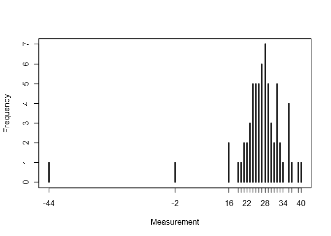
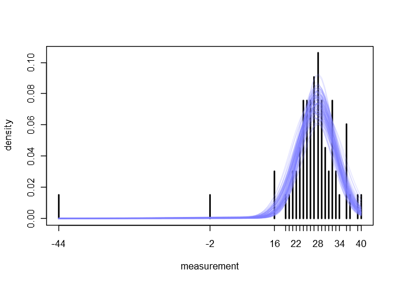
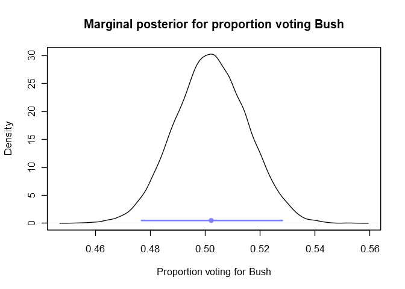
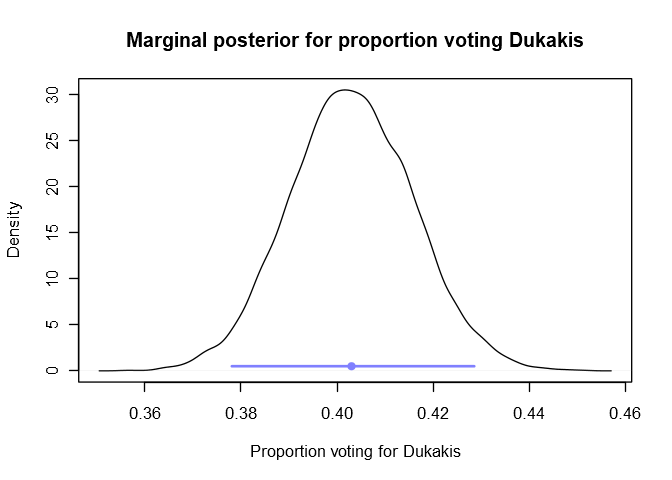
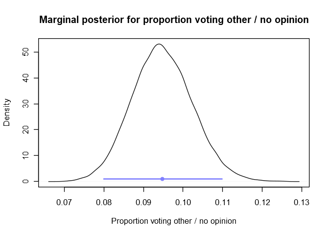
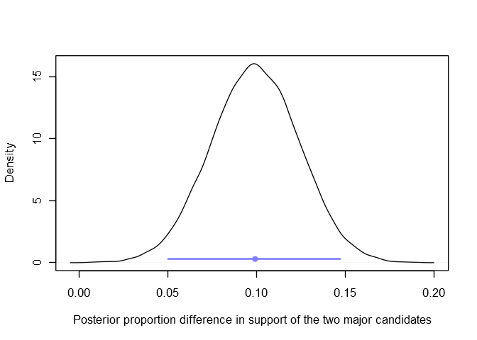
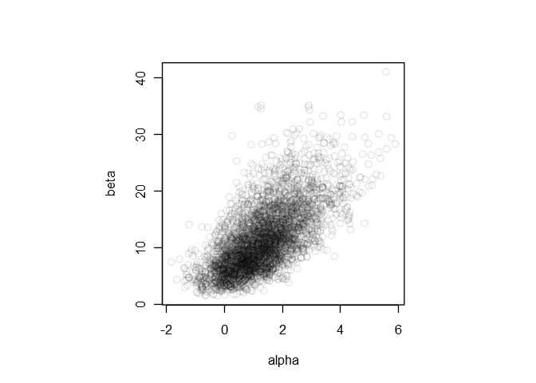
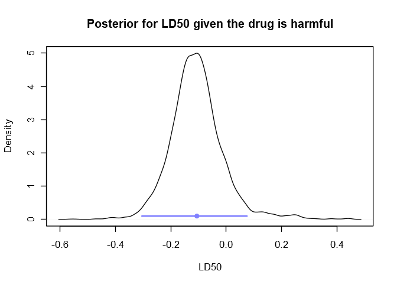

Chapter 3: Introduction to multiparameter models
================

Libraries for models and helper functions for plots:

``` r
library(brms)
library(coda)
library(tools)

# The following helper functions are from the 'rethinking' package.
# https://github.com/rmcelreath/rethinking

col.alpha <- function( acol , alpha=0.2 ) {
    acol <- col2rgb(acol)
    acol <- rgb(acol[1]/255,acol[2]/255,acol[3]/255,alpha)
    acol
}

col.desat <- function( acol , amt=0.5 ) {
    acol <- col2rgb(acol)
    ahsv <- rgb2hsv(acol)
    ahsv[2] <- ahsv[2] * amt
    hsv( ahsv[1] , ahsv[2] , ahsv[3] )
}

rangi2 <- col.desat("blue", 0.5)

simplehist <- function (x, round = TRUE, ylab = "Frequency", ...) 
{
    if (round == TRUE) 
        x <- round(x)
    plot(table(x), ylab = ylab, ...)
}
```

# 3.2 Normal data with a noninformative prior distribution

## Example: Estimating the speed of light

> Simon Newcomb set up an experiment in 1882 to measure the speed of
> light. Newcomb measured the amount of time required for light to
> travel a distance of 7442 meters. A histogram of Newcomb’s 66
> measurements is shown \[below\].

``` r
# http://www.stat.columbia.edu/~gelman/book/data/light.asc
light <- c(
    28, 26, 33, 24, 34, -44, 27, 16, 40, -2,
    29, 22, 24, 21, 25, 30, 23, 29, 31, 19,
    24, 20, 36, 32, 36, 28, 25, 21, 28, 29,
    37, 25, 28, 26, 30, 32, 36, 26, 30, 22,
    36, 23, 27, 27, 28, 27, 31, 27, 26, 33,
    26, 32, 32, 24, 39, 28, 24, 25, 32, 25,
    29, 27, 28, 29, 16, 23
)
simplehist(light, xlab = "Measurement")
```

<!-- -->

> We (inappropriately) apply the normal model, assuming that all 66
> measurements are independent draws from a normal distribution.

Why “inappropriately”? Because of the outliers?

``` r
m3_1 <- brm(
    light ~ 1,
    data = list(light = light)
)
```

``` r
summary(m3_1)
```

    ##  Family: gaussian 
    ##   Links: mu = identity; sigma = identity 
    ## Formula: light ~ 1 
    ##    Data: list(light = light) (Number of observations: 66) 
    ## Samples: 4 chains, each with iter = 2000; warmup = 1000; thin = 1;
    ##          total post-warmup samples = 4000
    ## 
    ## Population-Level Effects: 
    ##           Estimate Est.Error l-95% CI u-95% CI Eff.Sample Rhat
    ## Intercept    26.24      1.30    23.71    28.86       2771 1.00
    ## 
    ## Family Specific Parameters: 
    ##       Estimate Est.Error l-95% CI u-95% CI Eff.Sample Rhat
    ## sigma    10.86      0.97     9.10    12.89       3436 1.00
    ## 
    ## Samples were drawn using sampling(NUTS). For each parameter, Eff.Sample 
    ## is a crude measure of effective sample size, and Rhat is the potential 
    ## scale reduction factor on split chains (at convergence, Rhat = 1).

The best place to start looking for a better model of the measurements
would be to study the setup of the specific experiment. A more
appropriate likelihood and informed informative priors would go a long
way toward improving the estimate of the true speed of light. However,
the “actual causes and precise nature of these systematic errors are not
known today” \[[Eisenhart, discussion of
Stigler 1977](https://www.jstor.org/stable/2958645)\].

Gelman suggests later in chapter 6 that

> A revised model might use an asymmetric contaminated normal
> distribution or a symmetric long-tailed distribution in place of the
> normal measurement model.

Without further knowledge of the setup of the experiment (though
Eisenhard suggests in his discussion linked above that these estimates
were affected by “enormous positive systematic errors”) it seems
reasonable to assume that the error distribution is symmetric. It’s not
surprising to see outliers on one side of the bulk considering there are
only 66 measurements.

The contaminated normal distribution is a mixture of two normal
distributions, defined by

f(x) = (1 - alpha)\*Normal(x | mu, sigma) + alpha\*Normal(x | mu,
lambda\*sigma),

where 0 \< alpha \< 1 is the mixing parameter and lamda \> 1 scales the
standard deviation of the wider component. Alpha can be interpreted as
the probability that a given sample is contaminated by experimental
error.

Contaminated normals are not included in **brms**, so we will define
them using its `custom_family()` function. See [the brms vignette for
custom
families](https://cran.r-project.org/web/packages/brms/vignettes/brms_customfamilies.html).
We mix the two normals using Stan’s `log_mix()` function; see section
13.5 of the [Stan User’s Guide and Reference
Manual](http://mc-stan.org/users/documentation/).

``` r
contam_normal <- custom_family(
    name = "contam_normal",
    dpars = c("mu", "sigma", "alpha", "lambda"),
    links = c("identity", "log", "logit", "logm1"),
    type = "real",
    lb = c(NA, 0, 0, 1),
    ub = c(NA, NA, 1, NA)
)

stan_funs <- "
    real contam_normal_lpdf(real y, real mu, real sigma, real alpha, real lambda) {
        return log_mix(alpha, normal_lpdf(y | mu, lambda * sigma), normal_lpdf(y | mu, sigma));
    }
    real contam_normal_rng(real mu, real sigma, real alpha, real lambda) {
        return (1 - alpha) * normal_rng(mu, sigma) + alpha * normal_rng(mu, lambda * sigma);
    }
"

stanvars <- stanvar(scode = stan_funs, block = "functions")
```

Now we can fit our model using this custom likelihood. We’ll put an
informative prior on the scale parameter lambda since it has a tendency
to get huge.

``` r
m3_2 <- brm(
    light ~ 1,
    family = contam_normal,
    prior = prior(student_t(3, 0, 10), class = lambda),
    stanvars = stanvars,
    data = list(light = light)
)
```

``` r
summary(m3_2)
```

    ##  Family: contam_normal 
    ##   Links: mu = identity; sigma = identity; alpha = identity; lambda = identity 
    ## Formula: light ~ 1 
    ##    Data: list(light = light) (Number of observations: 66) 
    ## Samples: 4 chains, each with iter = 2000; warmup = 1000; thin = 1;
    ##          total post-warmup samples = 4000
    ## 
    ## Population-Level Effects: 
    ##           Estimate Est.Error l-95% CI u-95% CI Eff.Sample Rhat
    ## Intercept    27.73      0.66    26.41    29.03       3992 1.00
    ## 
    ## Family Specific Parameters: 
    ##        Estimate Est.Error l-95% CI u-95% CI Eff.Sample Rhat
    ## sigma      5.08      0.49     4.21     6.11       3514 1.00
    ## alpha      0.06      0.04     0.01     0.15       3832 1.00
    ## lambda    11.00      5.31     4.86    25.42       3172 1.00
    ## 
    ## Samples were drawn using sampling(NUTS). For each parameter, Eff.Sample 
    ## is a crude measure of effective sample size, and Rhat is the potential 
    ## scale reduction factor on split chains (at convergence, Rhat = 1).

The estimated mean has shifted upward a bit but the top end of its 95%
density interval is basically the same as before. This model doesn’t get
us any closer to the truth.

We can plot a few sampled contaminated normals to get an idea of the
uncertainty of our fit.

``` r
post <- as.data.frame(m3_2)

plot(table(light)/length(light), xlab = "measurement", ylab = "density")

for(i in 1:100)
    curve(
        (1 - post$alpha[i])*dnorm(x, mean = post$b_Intercept[i], sd = post$sigma[i]) +
            post$alpha[i]*dnorm(x, mean = post$b_Intercept[i], sd = post$lambda[i]*post$sigma[i]),
        col = col.alpha(rangi2, 0.2),
        add = TRUE
    )
```

<!-- -->

Newcomb made many measurements and “combined the times through a
weighted mean” to generate each data point in the table
\[[Stigler 1977](https://www.jstor.org/stable/2958645)\]. Apparently
this pre data is lost to time, but it would be ideal to incorporate
information about the individual distributions of these groups of
measurements into the model. We could, for example, pass **brms** the
standard deviation of each group of measurements along with their mean
using the syntax

    light | se(<standard deviation>, sigma = TRUE) ~ 1

to weight data points with high variance less.

# 3.4 Multinomial model for categorical data

## Example. Pre-election polling

The multinomial likelihood is implemented in **brms** as the
`categorical` family. As far as I can tell, multinomial data can’t be
passed to the model in an aggregated format like it can be with a
binomial likelihood (using `trials()` in the regression formula). So we
explode the data, passing the model a list of 727 ones, 583 twos, and
137 threes, with one, two, and three representing the three different
results of the poll.

``` r
polling <- c(rep(1, 727), rep(2, 583), rep(3, 137))
m3_3 <- brm(
    polling ~ 1,
    family = categorical,
    data = list(polling = polling),
    iter = 5e3,
    warmup = 1e3,
    chains = 4,
    cores = 4
)
```

``` r
summary(m3_3)
```

    ##  Family: categorical 
    ##   Links: mu2 = logit; mu3 = logit 
    ## Formula: polling ~ 1 
    ##    Data: list(polling = polling) (Number of observations: 1447) 
    ## Samples: 4 chains, each with iter = 5000; warmup = 1000; thin = 1;
    ##          total post-warmup samples = 16000
    ## 
    ## Population-Level Effects: 
    ##               Estimate Est.Error l-95% CI u-95% CI Eff.Sample Rhat
    ## mu2_Intercept    -0.22      0.06    -0.33    -0.11      10906 1.00
    ## mu3_Intercept    -1.67      0.09    -1.86    -1.49      11850 1.00
    ## 
    ## Samples were drawn using sampling(NUTS). For each parameter, Eff.Sample 
    ## is a crude measure of effective sample size, and Rhat is the potential 
    ## scale reduction factor on split chains (at convergence, Rhat = 1).

Because we have three categories, the model estimates two parameters;
the first category is set to 0. The other two categories are log-odds
ratios relative to the first category. So we have (roughly)

log(Pr(1)/Pr(1)) = 0 (= mu1),

log(Pr(2)/Pr(1)) = mu2,

log(Pr(3)/Pr(1)) = mu3.

We can retrieve the probabilities themselves using the formula

Pr(K) = exp(muK)/(exp(mu1) + exp(mu2) + exp(mu3)).

``` r
sm <- function(a, b, c) {
    total <- exp(a) + exp(b) + exp(c)
    c(exp(a)/total, exp(b)/total, exp(c)/total)
}

softmax <- Vectorize(sm, vectorize.args = c("a", "b", "c"))

samples <- as.data.frame(m3_3)
post <- softmax(rep(0, nrow(samples)), samples$b_mu2_Intercept, samples$b_mu3_Intercept)
```

Below we plot the posteriors for the proportions of people voting each
way, along with blue dots representing the means of the posteriors and
blue lines representing the 95% highest posterior density intervals.

``` r
plot(
    density(post[1,]),
    xlab = "Proportion voting for Bush",
    ylab = "Density",
    main = "Marginal posterior for proportion voting Bush"
)

lines(HPDinterval(as.mcmc(post[1,]))[1,], c(0.5, 0.5), lwd = 2, col = rangi2)

points(mean(post[1,]), 0.5, pch = 16, col = rangi2)
```

<!-- -->

``` r
plot(
    density(post[2,]),
    xlab = "Proportion voting for Dukakis",
    ylab = "Density",
    main = "Marginal posterior for proportion voting Dukakis"
)

lines(HPDinterval(as.mcmc(post[2,]))[1,], c(0.5, 0.5), lwd = 2, col = rangi2)

points(mean(post[2,]), 0.5, pch = 16, col = rangi2)
```

<!-- -->

``` r
plot(
    density(post[3,]),
    xlab = "Proportion voting other / no opinion",
    ylab = "Density",
    main = "Marginal posterior for proportion voting other / no opinion"
)

lines(HPDinterval(as.mcmc(post[3,]))[1,], c(1, 1), lwd = 2, col = rangi2)

points(mean(post[3,]), 1, pch = 16, col = rangi2)
```

<!-- -->

Here’s the posterior for the difference in proportions of those voting
for Bush and Dukakis.

``` r
plot(
    density(post[1,] - post[2,]),
    xlab = "Posterior proportion difference in support of the two major candidates",
    ylab = "Density",
    main = ""
)

lines(HPDinterval(as.mcmc(post[1,] - post[2,]))[1,], c(0.3, 0.3), lwd = 2, col = rangi2)

points(mean(post[1,] - post[2,]), 0.3, pch = 16, col = rangi2)
```

<!-- -->

The posterior probability that Bush had more support than Dukakis in the
survey
population:

``` r
sum(post[1,] > post[2,])/ncol(post)
```

    ## [1] 1

# 3.7 Example: analysis of a bioassay experiment

``` r
bioa <- list(dose = c(-0.86, -0.3, -0.05, 0.73), animals = c(5, 5, 5, 5), deaths = c(0, 1, 3, 5))
m3_4 <- brm(
    deaths | trials(animals) ~ dose,
    family = binomial,
    data = bioa
)
```

``` r
summary(m3_4)
```

    ##  Family: binomial 
    ##   Links: mu = logit 
    ## Formula: deaths | trials(animals) ~ dose 
    ##    Data: bioa (Number of observations: 4) 
    ## Samples: 4 chains, each with iter = 2000; warmup = 1000; thin = 1;
    ##          total post-warmup samples = 4000
    ## 
    ## Population-Level Effects: 
    ##           Estimate Est.Error l-95% CI u-95% CI Eff.Sample Rhat
    ## Intercept     1.32      1.12    -0.64     3.83       1714 1.00
    ## dose         11.54      5.69     3.34    25.07       1460 1.00
    ## 
    ## Samples were drawn using sampling(NUTS). For each parameter, Eff.Sample 
    ## is a crude measure of effective sample size, and Rhat is the potential 
    ## scale reduction factor on split chains (at convergence, Rhat = 1).

``` r
samples <- as.data.frame(m3_4)
par(pty = "s")
plot(samples$b_dose ~ samples$b_Intercept, col = col.alpha("black", 0.1), xlab = "alpha", ylab = "beta")
```

<!-- -->

The probability that the drug is harmful:

``` r
sum(samples$b_dose > 0)/nrow(samples)
```

    ## [1] 1

``` r
# (all samples had beta > 0)
sum(samples$b_dose > 0)
```

    ## [1] 4000

Here’s the posterior for the LD50, conditional on the drug being harmful
(that is, using samples for which the dose coefficient is positive). We
also show the mean and 95% HPDI in
blue.

``` r
ld50 <- -samples[samples$b_dose > 0,]$b_Intercept / samples[samples$b_dose > 0,]$b_dose
HPDI <- HPDinterval(as.mcmc(ld50))[1,]

plot(
    density(ld50),
    xlab = "LD50",
    ylab = "Density",
    main = "Posterior for LD50 given the drug is harmful"
)

lines(HPDI, c(0.1, 0.1), lwd = 2, col = rangi2)

points(mean(ld50), 0.1, pch = 16, col = rangi2)
```

<!-- -->

``` r
# mean and HPDI for the LD50
data.frame(
    mean = round(mean(ld50), 2),
    HPDI_95 = paste(round(HPDI[1], 2), "to", round(HPDI[2], 2))
)
```

    ##    mean      HPDI_95
    ## 1 -0.11 -0.3 to 0.08

-----

[Antonio R. Vargas](https://github.com/szego)

16 Nov 2018
