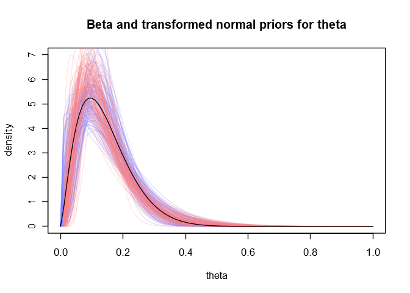
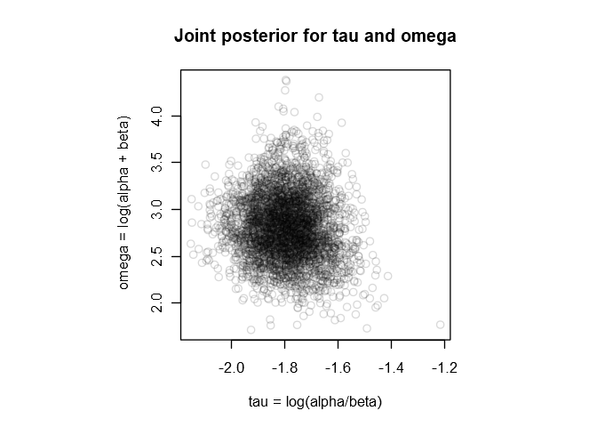
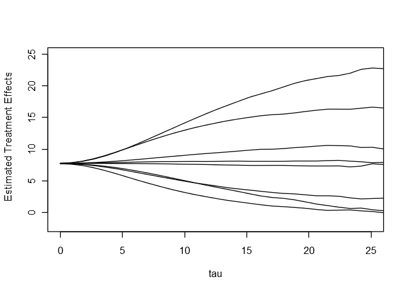

Chapter 5: Hierarchical models
================

> Perhaps even more important in practice is that simple nonhierarchical
> models are usually inappropriate for hierarchical data: with few
> parameters, they generally cannot fit large datasets accurately,
> whereas with many parameters, they tend to ‘overfit’ such data in the
> sense of producing models that fit the existing data well but lead to
> inferior predictions for the new data. In contrast, hierarchical
> models can have enough parameters to fit the data well, while using a
> population distribution to structure some dependence into the
> parameters, thereby avoiding problems of overfitting. As we show in
> the examples in this chapter, it is often sensible to fit hierarchical
> models with more parameters than there are data points.

Libraries for models and helper functions for plots:

``` r
library(rstan)
library(brms)
library(coda)
library(gtools)    # for logit()
library(MASS)      # for mvrnorm()
library(mixtools)  # for ellipse()
library(plotrix)   # for draw.ellipse()

# The following helper functions are from the 'rethinking' package.
# https://github.com/rmcelreath/rethinking

col.alpha <- function( acol , alpha=0.2 ) {
    acol <- col2rgb(acol)
    acol <- rgb(acol[1]/255,acol[2]/255,acol[3]/255,alpha)
    acol
}

col.desat <- function( acol , amt=0.5 ) {
    acol <- col2rgb(acol)
    ahsv <- rgb2hsv(acol)
    ahsv[2] <- ahsv[2] * amt
    hsv( ahsv[1] , ahsv[2] , ahsv[3] )
}

rangi2 <- col.desat("blue", 0.5)
red2 <- col.desat("red", 0.5)
```

# 5.1 Constructing a parameterized prior distribution

## Example. Estimating the risk of tumor in a group of rats

The data for this example is available from [Gelman’s
website](http://www.stat.columbia.edu/~gelman/book/data/).

``` r
ratdata <- read.table("rats.asc", header = TRUE, skip = 3)
colnames(ratdata) <- c("tumors", "rats")
```

We’ll go ahead and fit a full probability model on the hyperparameters
of the Beta prior. As such this will be a combination of sections 5.1
and 5.3.

The **rethinking** package can *almost* run this model. Strangely it
comments out certain key lines in the Stan code it generates which
prevents it from compiling. [As I explained in the notes for
chapter 2](https://github.com/szego/BDA-singalong/blob/master/ch02.md#estimating-the-prior-from-the-data),
**brms** can’t run this kind of model either.

### Fitting the model with Stan

Stan can definitely handle it, though. I implement it below, using the
parameterization for the Beta prior the book suggests later in section
5.3: we set `tau = log(alpha/beta)` and `omega = log(alpha + beta)`, and
estimate `tau` and `omega` instead of `alpha` and `beta`. This
parameterization is substantially easier to fit.

It’s straightforward to set weakly informative priors for the
hyperparameters `tau` and `omega`; we can just use wide distributions
centered at 0. We’ll use Student t-distributions with 3 degrees of
freedom and standard deviations equal to 10.

The hyperparameters have pretty low numbers of effective samples (n\_eff
in the output below) so I run the model for 120,000 iterations to make
sure to get enough. It takes about a minute to sample on my laptop after
compiling.

``` r
model_code <- "
data{
    int<lower=1> N;
    int<lower=1> rats[N];
    int<lower=0> tumors[N];
}
parameters{
    real<lower=0,upper=1> p[N];
    real tau;
    real omega;
}
transformed parameters{
    real<lower=0> shape_alpha;
    real<lower=0> shape_beta;
    shape_alpha = exp(tau + omega)/(1 + exp(tau));
    shape_beta = exp(omega)/(1 + exp(tau));
}
model{
    // priors
    tau ~ student_t(3, 0, 10);
    omega ~ student_t(3, 0, 10);
    for (i in 1:N)
        p[i] ~ beta(shape_alpha, shape_beta);
    
    // likelihood
    tumors ~ binomial(rats, p);
}
"

m5_1 <- stan(
    model_code = model_code,
    data = list(
        N = nrow(ratdata),
        rats = ratdata$rats,
        tumors = ratdata$tumors
    ),
    iter = 3e4,
    warmup = 2e3,
    chains = 4,
    cores = 4
)
```

In the posterior summary below we see the adjusted estimates for the
current experiment’s tumor probability and for the hyperparameters `tau`
and `omega`. I’ve also included the posteriors for the usual shape
parameters for the Beta distribution, `alpha` and `beta`.

``` r
print(
    summary(
        m5_1,
        pars = c("p[71]", "tau", "omega", "shape_alpha", "shape_beta"),
        probs = c(0.025, 0.975)
    )$summary
)
```

    ##                   mean      se_mean         sd        2.5%      97.5%
    ## p[71]        0.2082148 0.0001729507 0.07424025  0.08583587  0.3739366
    ## tau         -1.7953112 0.0003014095 0.10761701 -2.00867649 -1.5864216
    ## omega        2.8092144 0.0022433273 0.34761152  2.16307682  3.5358559
    ## shape_alpha  2.5161592 0.0066530374 0.96539753  1.24547624  4.9274904
    ## shape_beta  15.1478525 0.0383656337 5.75005810  7.39762557 29.4541761
    ##                 n_eff      Rhat
    ## p[71]       184261.29 0.9999846
    ## tau         127481.72 1.0000014
    ## omega        24010.60 1.0001136
    ## shape_alpha  21055.83 1.0001177
    ## shape_beta   22462.58 1.0001128

Let’s plot a few sampled priors in blue against the book’s Beta(1.4,
8.6) prior in black and dashed.

``` r
samples_1 <- extract(m5_1)

curve(
    dbeta(x, 1.4, 8.6),
    from = 0, to = 1,
    ylim = c(0, 7),
    xlab = "theta", ylab = "density",
    main = "Beta prior for theta",
    type = "n"
)

for(i in 1:100)
    curve(
        dbeta(x, samples_1$shape_alpha[i], samples_1$shape_beta[i]),
        col = col.alpha(rangi2, 0.25),
        add = TRUE
    )

curve(dbeta(x, 1.4, 8.6), lty = 2, add = TRUE)
```

<!-- -->

### Fitting a similar model with **brms**

Of course we don’t have to use an adaptive Beta prior. If we take the
logit of the binomial parameter p, we can fit an adaptive normal prior
on the transformed estimates instead. This is where **brms** shines.

``` r
ratdata$experiment <- 1:nrow(ratdata)

m5_2 <- brm(
    tumors | trials(rats) ~ (1 | experiment),
    family = binomial,
    data = ratdata,
    iter = 2e4,
    warmup = 1e3,
    control = list(adapt_delta = 0.95),
    chains = 4,
    cores = 4
)
```

``` r
summary(m5_2)
```

    ##  Family: binomial 
    ##   Links: mu = logit 
    ## Formula: tumors | trials(rats) ~ (1 | experiment) 
    ##    Data: ratdata (Number of observations: 71) 
    ## Samples: 4 chains, each with iter = 20000; warmup = 1000; thin = 1;
    ##          total post-warmup samples = 76000
    ## 
    ## Group-Level Effects: 
    ## ~experiment (Number of levels: 71) 
    ##               Estimate Est.Error l-95% CI u-95% CI Eff.Sample Rhat
    ## sd(Intercept)     0.71      0.13     0.47     1.00      24231 1.00
    ## 
    ## Population-Level Effects: 
    ##           Estimate Est.Error l-95% CI u-95% CI Eff.Sample Rhat
    ## Intercept    -1.95      0.13    -2.22    -1.72      32763 1.00
    ## 
    ## Samples were drawn using sampling(NUTS). For each parameter, Eff.Sample 
    ## is a crude measure of effective sample size, and Rhat is the potential 
    ## scale reduction factor on split chains (at convergence, Rhat = 1).

Here’s the new posterior summary for the Bayes-adjusted tumor
probability for the current experiment:

``` r
samples_2 <- as.data.frame(m5_2)

p71_samples <- inv_logit_scaled(samples_2$b_Intercept + samples_2$r_experiment.71.Intercept.)
p71_mean <- mean(p71_samples)
p71_sd <- sd(p71_samples)
p71_HPI <- HPDinterval(as.mcmc(p71_samples))[1,]

data.frame(
    experiment = 71,
    mean = round(p71_mean, 3),
    sd = round(p71_sd, 3),
    HPDI_95 = paste(round(p71_HPI[1], 2), "to", round(p71_HPI[2], 2))
)
```

    ##   experiment  mean    sd      HPDI_95
    ## 1         71 0.207 0.078 0.07 to 0.36

This is basically the same as the result from the first model.

Just for fun, let’s map the some sampled normal priors back to the
interval \[0,1\] by reversing the logit map and plot them in red against
our blue estimated Beta priors from the first model. The book’s
Beta(1.4, 8.6) prior is again shown dashed in black.

``` r
curve(
    dbeta(x, 1.4, 8.6),
    from = 0, to = 1,
    ylim = c(0, 7),
    xlab = "theta", ylab = "density",
    main = "Beta and transformed normal priors for theta",
    type = "n"
)

for(i in 1:100)
    curve(
        dbeta(x, samples_1$shape_alpha[i], samples_1$shape_beta[i]),
        col = col.alpha(rangi2, 0.25),
        add = TRUE
    )

for(i in 1:100) {
    mu <- samples_2$b_Intercept[i]
    sigma <- samples_2$sd_experiment__Intercept[i]
    curve(
        dnorm(log(x) - log(1-x), mu, sigma)/(x*(1-x)),
        col = col.alpha(red2, 0.22),
        add = TRUE
    )
}

curve(dbeta(x, 1.4, 8.6), lty = 2, add = TRUE)
```

<!-- -->

The bulk of the uncertainty is very similar between the two priors.

# 5.2 Exchangeability and sampling

## Exchangeability when additional information is available on the units

> If \(y_i\) has additional information \(x_i\) so that \(y_i\) are not
> exchangeable but \((y_i, x_i)\) still are exchangeable, then we can
> make a joint model for \((y_i, x_i)\) or a conditional model for
> \(y_i \mid x_i\).

> For states having the same last year divorce rates \(x_j\), we could
> use grouping and assume partial exchangeability.

This would be a two-level hierarchical model with separate adaptive
priors for each group of states with the same divorce rates. One way to
do this would be to use an adaptive hyperprior on the hyperparameters of
the adaptive priors to model variation among the groups. Alternatively
we could separate the groups in the model formula like

    (1 | state) + (1 | same_previous_rate)

which can also be written `(1 | state + same_previous_rate)`. This
second method has the added benefit of allowing us to control for the
average effect of each of the two groupings.

> If there are many possible values for \(x_j\) (as we would assume for
> divorce rates) we could assume conditional exchangeability and use
> \(x_j\) as a covariate in the regression model.

So including a predictor in the model formula is equivalent to assuming
exchangeability conditional on that predictor and model formula.

# 5.3 Bayesian analysis of conjugate hierarchical models

## Application to the model for rat tumors

We already carried out the full Bayesian treatment of this problem
above. Let’s plot our sampled Beta priors against the book’s estimated
Beta(2.4, 14.3) prior, shown in solid black.

``` r
curve(
    dbeta(x, 1.4, 8.6),
    from = 0, to = 1,
    ylim = c(0, 7),
    xlab = "theta", ylab = "density",
    main = "Beta and transformed normal priors for theta",
    type = "n"
)

for(i in 1:100)
    curve(
        dbeta(x, samples_1$shape_alpha[i], samples_1$shape_beta[i]),
        col = col.alpha(rangi2, 0.25),
        add = TRUE
    )

for(i in 1:100) {
    mu <- samples_2$b_Intercept[i]
    sigma <- samples_2$sd_experiment__Intercept[i]
    curve(
        dnorm(log(x) - log(1-x), mu, sigma)/(x*(1-x)),
        col = col.alpha(red2, 0.22),
        add = TRUE
    )
}

curve(dbeta(x, 2.4, 14.3), add = TRUE)
```

<!-- -->

And here’s our version of Figure 5.3(b).

``` r
tau <- samples_1$tau[1:4000]
omega <- samples_1$omega[1:4000]

par(pty = "s")
plot(
    omega ~ tau,
    col = col.alpha("black", 0.15),
    xlab = "tau = log(alpha/beta)", ylab = "omega = log(alpha + beta)",
    main = "Joint posterior for tau and omega"
)
```

<!-- -->

# 5.5 Example: parallel experiments in eight schools

## Inferences based on nonhierarchical models and their problems

### A pooled estimate

> Under the hypothesis that all experiments have the same effect and
> produce independent estimates of this common effect, we could treat
> the data \[…\] as eight normally distributed observations with known
> variances.

``` r
schools <- data.frame(
    school = c("A", "B", "C", "D", "E", "F", "G", "H"),
    est_effect = c(28, 8, -3, 7, -1, 1, 18, 12),
    std_err = c(15, 10, 16, 11, 9, 11, 10, 18)
)
```

We’ll fit a model which uses the known standard errors for these effects
and also estimates the posterior standard deviation of their
distribution.

``` r
m5_3 <- brm(
    est_effect | se(std_err, sigma = TRUE) ~ 1,
    data = schools,
    iter = 3e4,
    warmup = 2e3
)
```

``` r
summary(m5_3)
```

    ##  Family: gaussian 
    ##   Links: mu = identity; sigma = identity 
    ## Formula: est_effect | se(std_err, sigma = TRUE) ~ 1 
    ##    Data: schools (Number of observations: 8) 
    ## Samples: 4 chains, each with iter = 30000; warmup = 2000; thin = 1;
    ##          total post-warmup samples = 112000
    ## 
    ## Population-Level Effects: 
    ##           Estimate Est.Error l-95% CI u-95% CI Eff.Sample Rhat
    ## Intercept     7.87      4.23    -0.43    16.28      45076 1.00
    ## 
    ## Family Specific Parameters: 
    ##       Estimate Est.Error l-95% CI u-95% CI Eff.Sample Rhat
    ## sigma     4.89      3.89     0.19    14.47      60882 1.00
    ## 
    ## Samples were drawn using sampling(NUTS). For each parameter, Eff.Sample 
    ## is a crude measure of effective sample size, and Rhat is the potential 
    ## scale reduction factor on split chains (at convergence, Rhat = 1).

The mean and standard error of the intercept are similar those given in
the book (estimate = 7.7 and std error = 4.1).

> To get a feeling for the natural variation that we would expect across
> eight studies if this assumption were true, suppose the estimated
> treatment effects are eight independent draws from a normal
> distribution with mean 8 points and standard deviation 13 points (the
> square root of the mean of the eight variances).

Instead of using the point estimates for the mean and standard
deviations as in the text, we should probably use their complete
posteriors for this calculation (in other words, we should compute the
posterior predictive distribution).

``` r
samples <- as.data.frame(m5_3)
posterior <- rnorm(nrow(samples), samples$b_Intercept, samples$sigma)
post_mu <- mean(posterior)
post_HPI <- HPDinterval(as.mcmc(posterior))[1,]

plot(
    density(posterior),
    xlab = "effect",
    ylab = "density",
    main = "predictive distribution from complete pooling"
)

points(post_mu, 0.0015, pch = 16, col = rangi2)

lines(post_HPI, c(0.0015, 0.0015), lwd = 2, col = rangi2)
```

<!-- -->

Here’s a summary of this distribution.

``` r
post_sd <- sd(posterior)
data.frame(
    mean = round(post_mu, 2),
    sd = round(post_sd, 2),
    HPDI_95 = paste(round(post_HPI[1], 1), "to", round(post_HPI[2], 1))
)
```

    ##   mean   sd    HPDI_95
    ## 1 7.87 7.57 -7.1 to 24

Based on this we expect the largest observed value to be about 24 points
and the smallest to be about -7 points.

> Thus, it would appear imprudent to believe that school A really has an
> effect as large as 28 points.

## Posterior simulation under the hierarchical model

Now we fit a multilevel model with an adaptive normal prior on the
estimates for each school. We’ll draw an absolute boatload of samples
(about 8 million) to make the plots in the next section as smooth as
possible.

``` r
m5_4 <- brm(
    est_effect | se(std_err) ~ (1 | school),
    data = schools,
    iter = 2e6,
    warmup = 3e3,
    chains = 4,
    cores = 4,
    control = list(adapt_delta = 0.99)
)
```

Sampling for this model takes between 5 and 10 minutes on my laptop.

``` r
summary(m5_4)
```

    ##  Family: gaussian 
    ##   Links: mu = identity; sigma = identity 
    ## Formula: est_effect | se(std_err) ~ (1 | school) 
    ##    Data: schools (Number of observations: 8) 
    ## Samples: 4 chains, each with iter = 2e+06; warmup = 3000; thin = 1;
    ##          total post-warmup samples = 7988000
    ## 
    ## Group-Level Effects: 
    ## ~school (Number of levels: 8) 
    ##               Estimate Est.Error l-95% CI u-95% CI Eff.Sample Rhat
    ## sd(Intercept)     4.88      3.91     0.19    14.54    5258719 1.00
    ## 
    ## Population-Level Effects: 
    ##           Estimate Est.Error l-95% CI u-95% CI Eff.Sample Rhat
    ## Intercept     7.88      4.23    -0.41    16.24    7038916 1.00
    ## 
    ## Samples were drawn using sampling(NUTS). For each parameter, Eff.Sample 
    ## is a crude measure of effective sample size, and Rhat is the potential 
    ## scale reduction factor on split chains (at convergence, Rhat = 1).

Let’s plot the marginal posteriors for the effect at each school.

``` r
samples <- as.data.frame(m5_4)
school_posts <- apply(samples[,3:10], 2, function(x) x + samples$b_Intercept)
school_mus <- apply(school_posts, 2, mean)
school_sds <- apply(school_posts, 2, sd)
school_HPIs <- apply(school_posts, 2, function(x) HPDinterval(as.mcmc(x))[1,])

for (i in 1:8) {
    plot(
        density(school_posts[,i]),
        xlim = c(-22, 38),
        ylim = c(0, 0.081),
        xlab = paste("Bayes-adjusted school", schools$school[i], "effect"),
        ylab = "density",
        main = ""
    )
    
    points(school_mus[i], 0.002, pch = 16, col = rangi2)
    
    lines(school_HPIs[,i], c(0.002, 0.002), lwd = 2, col = rangi2)
}
```

<!-- --><!-- --><!-- --><!-- --><!-- --><!-- --><!-- --><!-- -->

``` r
results <- data.frame(
    school = schools$school,
    Bayes_adjusted_effect = round(school_mus, 1),
    sd = round(school_sds, 1),
    HPDI_95 = paste(round(school_HPIs[1,]), "to", round(school_HPIs[2,]))
)
rownames(results) <- NULL
results
```

    ##   school Bayes_adjusted_effect  sd  HPDI_95
    ## 1      A                  10.2 6.9 -3 to 25
    ## 2      B                   7.9 5.6 -3 to 19
    ## 3      C                   6.7 6.5 -7 to 20
    ## 4      D                   7.7 5.8 -4 to 19
    ## 5      E                   5.8 5.7 -6 to 17
    ## 6      F                   6.6 5.9 -6 to 18
    ## 7      G                   9.9 5.9 -1 to 22
    ## 8      H                   8.2 6.6 -5 to 22

What’s the posterior probability that the coaching program in school A
(the school with the highest mean) is more effective than in school E
(the school with the lowest mean)?

``` r
sum(school_posts[,1] > school_posts[,5])/nrow(school_posts)
```

    ## [1] 0.698995

Is that a safe bet?

## Results

This subsection is all about tau, the standard deviation of the group
effects.

``` r
plot(
    density(samples$sd_school__Intercept, adj = 0.05),
    xlim = c(0, 30),
    xlab = "tau",
    ylab = "density",
    main = "Marginal posterior for tau"
)
```

<!-- -->

Because we’re working with samples it’s a bit harder to access the
conditional posterior means of the treatment effects. We’ll attempt to
re-create the book’s figures 5.6 and 5.7 using the approximation

    (theta_j | tau = t) ~ (theta_j | t - 1 < tau < t + 1).

For each t between 0 and 25, we compute the means for each school using
only the samples for which tau is between t-1 and t+1.

``` r
marginal_mu <- function(tau) {
    posts <- school_posts[samples$sd_school__Intercept > tau - 1 & 
                              samples$sd_school__Intercept < tau + 1,]
    return(apply(posts, 2, mean))
}

marginal_sigma <- function(tau) {
    posts <- school_posts[samples$sd_school__Intercept > tau - 1 & 
                              samples$sd_school__Intercept < tau + 1,]
    return(apply(posts, 2, sd))
}

tau.seq <- seq(from = 0, to = 26, length.out = 30)

mu_margins <- sapply(tau.seq, marginal_mu)
sigma_margins <- sapply(tau.seq, marginal_sigma)

plot(0, xlim = c(0, 25), ylim = c(-2, 25), xlab = "tau", ylab = "Estimated Treatment Effects", type = "n")

for (i in 1:8)
    lines(tau.seq, mu_margins[i,])
```

<!-- -->

``` r
plot(0, xlim = c(0, 25), ylim = c(0, 18), xlab = "tau", ylab = "Posterior Standard Deviations", type = "n")

for (i in 1:8)
    lines(tau.seq, sigma_margins[i,])
```

<!-- -->

(These are the plots we needed so many samples for. Higher values of tau
are less and less likely, so we need lots of samples overall to get
enough samples in which tau is large.)

Next the book calculates the probability that school A’s effect is \< 28
is 93%, given that tau = 10. To make a similar calculation with the
samples, we can pick out the samples for which tau is within 0.05 of
10.

``` r
# The probability that school A's effect is < 28 given that 9.95 < tau < 10.05
A <- school_posts[9.95 < samples$sd_school__Intercept & samples$sd_school__Intercept < 10.05, 1]
sum(A < 28)/length(A)
```

    ## [1] 0.9382785

## Discussion

Finally a sequence of statistics is computed from the posterior samples.

The posterior probability that the effect in school A is \> 28 points:

``` r
sum(school_posts[,1] > 28)/nrow(school_posts)
```

    ## [1] 0.01943615

The posterior probability that the effect of ANY school is \> 28 points:

``` r
maxes <- apply(school_posts, 1, max)
sum(maxes > 28)/nrow(school_posts)
```

    ## [1] 0.03421207

Here’s a re-creation of figure 5.8:

``` r
plot(
    density(maxes),
    xlim = c(-22, 38),
    xlab = "Largest Effect",
    ylab = "Density",
    main = ""
)
```

<!-- -->

And the posterior probability that the coaching program in school A is
more effective than in school C:

``` r
sum(school_posts[,1] > school_posts[,3])/nrow(school_posts)
```

    ## [1] 0.6493784

# 5.6 Hierarchical modeling applied to a meta-analysis

The data for this example is available from [Gelman’s
website](http://www.stat.columbia.edu/~gelman/book/data/). Reading it
into R is a bit tricky since the columns are separated by an uneven
amount of whitespace in each row. There is probably a straightforward
way to do what’s below with just a single regular expression, but those
are still on my “to-learn” list.

``` r
metatext <- readChar("meta.asc", file.info("meta.asc")$size)
# skip the preamble
metatext <- substr(metatext, regexpr("\n\n", metatext) + 2, nchar(metatext))
# remove leading and trailing spaces around newlines
metatext <- gsub("\n ", "\n", metatext)
metatext <- gsub(" \n", "\n", metatext)
# replace repeated spaces with tabs
metatext <- gsub(" +", "\t", metatext)
# read the tab-delimited data into a data frame
meta <- read.delim(text = metatext)
```

The first model we will fit is exactly the one described in the book,
using the point estimates for the log odds ratios and their estimated
standard errors. This model is relatively straightforward to build but
has the shortcoming of relying on incomplete pictures of the
distributions of the log odds ratios.

Such approximations are unnecessary. To complement the book’s model we
will build a second model, a multivariate binomial regression, which
uses the original death counts and patient totals in the control and
treatment groups directly.

## A hierarchical normal model

We estimate the log odds ratios and their standard deviations using
formulas (5.23) and (5.24) in the book.

``` r
meta$log_odds_ratio <- log(meta$control.total/meta$control.deaths - 1) -
    log(meta$treated.total/meta$treated.deaths - 1)
meta$lor_sd <- sqrt(1/meta$treated.deaths + 1/(meta$treated.total - meta$treated.deaths) +
    1/meta$control.deaths + 1/(meta$control.total - meta$control.deaths))
```

We then implement the model described in the book using **brms**.

``` r
m5_5 <- brm(
    log_odds_ratio | se(lor_sd) ~ (1 | study),
    data = list(log_odds_ratio = meta$log_odds_ratio, lor_sd = meta$lor_sd, study = meta$study),
    iter =  2e4,
    warmup = 2e3,
    chains = 4,
    cores = 4,
    control = list(adapt_delta = 0.95)
)
```

``` r
summary(m5_5)
```

    ##  Family: gaussian 
    ##   Links: mu = identity; sigma = identity 
    ## Formula: log_odds_ratio | se(lor_sd) ~ (1 | study) 
    ##    Data: list(log_odds_ratio = meta$log_odds_ratio, lor_sd  (Number of observations: 22) 
    ## Samples: 4 chains, each with iter = 20000; warmup = 2000; thin = 1;
    ##          total post-warmup samples = 72000
    ## 
    ## Group-Level Effects: 
    ## ~study (Number of levels: 22) 
    ##               Estimate Est.Error l-95% CI u-95% CI Eff.Sample Rhat
    ## sd(Intercept)     0.13      0.08     0.01     0.31      23591 1.00
    ## 
    ## Population-Level Effects: 
    ##           Estimate Est.Error l-95% CI u-95% CI Eff.Sample Rhat
    ## Intercept    -0.25      0.07    -0.37    -0.11      55251 1.00
    ## 
    ## Samples were drawn using sampling(NUTS). For each parameter, Eff.Sample 
    ## is a crude measure of effective sample size, and Rhat is the potential 
    ## scale reduction factor on split chains (at convergence, Rhat = 1).

These posterior distributions for mu and tau match those in Table 5.5 in
the book.

Let’s plot the posterior predictive distribution for theta.

``` r
samples <- as.data.frame(m5_5)
predictive <- rnorm(nrow(samples), samples$b_Intercept, samples$sd_study__Intercept)
predictive_mu <- mean(predictive)
predictive_HPI <- HPDinterval(as.mcmc(predictive))[1,]

plot(
    density(predictive),
    xlim = c(-1.51, 1.1),
    xlab = "theta",
    ylab = "density",
    main = "Posterior predictive distribution"
)

points(predictive_mu, 0.05, col = rangi2, pch = 16)

lines(predictive_HPI, c(0.05, 0.05), lwd = 2, col = rangi2)
```

<!-- -->

In table form:

``` r
predictive_summary <- data.frame(
    mean = round(predictive_mu, 3),
    HPDI_95 = paste(round(predictive_HPI[1], 2), "to", round(predictive_HPI[2], 2))
)
rownames(predictive_summary) <- "predicted effect"
predictive_summary
```

    ##                    mean       HPDI_95
    ## predicted effect -0.248 -0.59 to 0.12

This also matches the posterior given in Table 5.5.

Finally, we compute the posterior probability that the true effect in a
new study will be positive.

``` r
sum(predictive > 0)/length(predictive)
```

    ## [1] 0.06613889

Strangely this is lower than the book’s conclusion that this probability
“is just over 10%”. Is that a typo?

## A multivariate binomial model

Now we’ll fit a model which uses the original counts directly. We will
model the number of deaths in a given study and group (control or
treatment) as a binomial random variable depending on a probability of
death **p** (to be estimated) and the number of patients in the group.

It seems plausible that external/unobserved factors specific to each
study might play a large role in determining the survival rates in the
study. Studies with lower (or higher) death rates in the control group
may also have lower (or higher) death rates in the treatment group. To
model this possible correlation we will place an adaptive *multivariate*
normal distribution on the logit-probability-of-death pairs **(logit
p\_control, logit p\_treated)**. For details on how to do this in
**brms** see its [multivariate models
vignette](https://cran.r-project.org/web/packages/brms/vignettes/brms_multivariate.html).

We’ll use weak priors on the hyperparameters of the multivariate normal.
In particular, we’ll use a Uniform(-1,1) prior for the correlation
between control and treatment logit-probabilities.

``` r
f1 <- bf(cdeaths | trials(ctotal) ~ (1 |p| study))
f2 <- bf(tdeaths | trials(ttotal) ~ (1 |p| study))

m5_6 <- brm(
    mvbf(f1, f2),
    family = binomial,
    data = list(
        cdeaths = meta$control.deaths,
        ctotal = meta$control.total,
        tdeaths = meta$treated.deaths,
        ttotal = meta$treated.total,
        study = meta$study
    ),
    iter = 4e4,
    warmup = 2e3,
    chains = 4,
    cores = 4,
    control = list(adapt_delta = 0.95)
)
```

``` r
summary(m5_6)
```

    ##  Family: MV(binomial, binomial) 
    ##   Links: mu = logit
    ##          mu = logit 
    ## Formula: cdeaths | trials(ctotal) ~ (1 | p | study) 
    ##          tdeaths | trials(ttotal) ~ (1 | p | study) 
    ##    Data: list(cdeaths = meta$control.deaths, ctotal = meta$ (Number of observations: 22) 
    ## Samples: 4 chains, each with iter = 40000; warmup = 2000; thin = 1;
    ##          total post-warmup samples = 152000
    ## 
    ## Group-Level Effects: 
    ## ~study (Number of levels: 22) 
    ##                                          Estimate Est.Error l-95% CI
    ## sd(cdeaths_Intercept)                        0.54      0.11     0.37
    ## sd(tdeaths_Intercept)                        0.51      0.10     0.35
    ## cor(cdeaths_Intercept,tdeaths_Intercept)     0.92      0.07     0.73
    ##                                          u-95% CI Eff.Sample Rhat
    ## sd(cdeaths_Intercept)                        0.78      48746 1.00
    ## sd(tdeaths_Intercept)                        0.75      55750 1.00
    ## cor(cdeaths_Intercept,tdeaths_Intercept)     1.00      69944 1.00
    ## 
    ## Population-Level Effects: 
    ##                   Estimate Est.Error l-95% CI u-95% CI Eff.Sample Rhat
    ## cdeaths_Intercept    -2.21      0.13    -2.47    -1.96      30615 1.00
    ## tdeaths_Intercept    -2.45      0.12    -2.70    -2.21      34930 1.00
    ## 
    ## Samples were drawn using sampling(NUTS). For each parameter, Eff.Sample 
    ## is a crude measure of effective sample size, and Rhat is the potential 
    ## scale reduction factor on split chains (at convergence, Rhat = 1).

That’s an extremely high estimate for the correlation between treated
and control death rates. Studies with higher death rates in their
control group are strongly expected to have higher death rates in their
treated group. It seems like external factors in each study
(environment, common patient background, or even bedside manner?) have a
very large effect on the outcomes.

### Visualizing the estimates

I’d like to get an idea of the shrinkage in the estimates induced by
this model.

We’ll first plot the raw logit-probabilities-of-death observed in the
data as translucent black ellipses, with the length of the axes
corresponding to the numbers of patients in the control and treated
groups. Larger ellipses indicate larger sample sizes.

Next we’ll plot the adjusted estimates from the model as blue dots and
connect these estimates to their corresponding raw probabilities with
black lines.

Finally we can visualize uncertainty in the correlation between control
and treated probabilities by plotting level curves of the multivariate
normal distributions corresponding to posterior samples of the
hyperparameters. The first 300 samples are used below.

``` r
samples <- as.data.frame(m5_6)

# mean estimates for the logit-probabilities-of-death
cdeaths <- sapply(6:27, function(i) samples$b_cdeaths_Intercept + samples[,i])
tdeaths <- sapply(28:49, function(i) samples$b_tdeaths_Intercept + samples[,i])
cdeaths_mu <- apply(cdeaths, 2, mean)
tdeaths_mu <- apply(tdeaths, 2, mean)

# observed logit-probabilities-of-death
cdeaths_obs <- gtools::logit(meta$control.deaths/meta$control.total)
tdeaths_obs <- gtools::logit(meta$treated.deaths/meta$treated.total)

plot(
    0,
    xlab = "logit-probability-of-death in control group",
    ylab = "logit-probability-of-death in treated group",
    xlim = c(-4, -0.5), ylim = c(-4, -1),
    asp = 1,
    type = "n"
)

# plot 95% density level curves for 300 sampled multivariate normal priors
for(i in 1:300) {
    Mu <- c(samples$b_cdeaths_Intercept[i], samples$b_tdeaths_Intercept[i])
    DS <- diag(c(samples$sd_study__cdeaths_Intercept[i], samples$sd_study__tdeaths_Intercept[i]))
    Rho <- matrix(c(1, rep(samples$cor_study__cdeaths_Intercept__tdeaths_Intercept[i], 2), 1), nrow = 2)
    Sigma <- DS %*% Rho %*% DS
    mixtools::ellipse(
        mu = Mu,
        sigma = Sigma,
        alpha = .05,
        npoints = 250,
        col = col.alpha(red2, 0.2)
    )
}

# draw lines connecting the observed rates with the estimates
for(i in 1:22)
    lines(c(cdeaths_mu[i], cdeaths_obs[i]), c(tdeaths_mu[i], tdeaths_obs[i]), lwd = 2)

# plot the observed and estimated logit-probabilities-of-death
for(i in 1:22)
    plotrix::draw.ellipse(
        cdeaths_obs[i], tdeaths_obs[i],
        0.002*sqrt(meta$control.total[i]), 0.002*sqrt(meta$treated.total[i]),
        border = "white", col = col.alpha("black", 0.4)
    )
points(cdeaths_mu, tdeaths_mu, pch = 21, bg = rangi2, col = "black", cex = 1.5)

# legend
points(-3.7, -1, pch = 21, bg = col.alpha("black", 0.4), col = "white", cex = 2)
points(-3.7, -1.2, pch = 21, bg = rangi2, col = "black", cex = 2)
text(-3.45, -0.985, labels = "observed")
text(-3.45, -1.185, labels = "estimate")
```

<!-- -->

Take a look at the two bottommost raw estimates, near the point (-2.7,
-3.5). They are initially very close together, but the resulting (blue)
estimate for the smaller study was pulled further from its starting
position than the one for the larger study.

In general, the estimates for smaller studies were shrunk more toward
the mean than the estimates for larger studies. This makes sense; there
should be more uncertainty about the estimates for smaller studies, so
their estimates should be more sensitive to information from the other
studies. There aren’t a lot of lopsided studies, where the numbers of
patients in their control and treated groups are very different, but I
would expect those studies to be pulled more in the direction
corresponding to whichever half (control or treated) had fewer patients.

### The new predictive distribution

In this case we need to sample from a multivariate normal distribution
to get the posterior predictive distribution.

``` r
predictive <- sapply(
    1:nrow(samples),
    function(i) {
        Mu <- c(samples$b_cdeaths_Intercept[i], samples$b_tdeaths_Intercept[i])
        DS <- diag(c(samples$sd_study__cdeaths_Intercept[i], samples$sd_study__tdeaths_Intercept[i]))
        Rho <- matrix(c(1, rep(samples$cor_study__cdeaths_Intercept__tdeaths_Intercept[i], 2), 1), nrow = 2)
        Sigma <- DS %*% Rho %*% DS
        MASS::mvrnorm(1, Mu, Sigma)
    }
)
log_odds_ratio <- predictive[2,] - predictive[1,]
lor_mu <- mean(log_odds_ratio)
lor_PI <- HPDinterval(as.mcmc(log_odds_ratio))[1,]

plot(
    density(log_odds_ratio),
    xlim = c(-1.51, 1.1),
    xlab = "theta", ylab = "density",
    main = "(New) Predictive distribution for theta"
)

points(lor_mu, 0.02, col = rangi2, pch = 16)

lines(lor_PI, c(0.02, 0.02), lwd = 2, col = rangi2)
```

<!-- -->

``` r
predictive_summary <- data.frame(
    mean = round(lor_mu, 3),
    HPDI_95 = paste(round(lor_PI[1], 2), "to", round(lor_PI[2], 2))
)
rownames(predictive_summary) <- "(new) predicted effect"
predictive_summary
```

    ##                         mean       HPDI_95
    ## (new) predicted effect -0.24 -0.72 to 0.25

Though the mean is the same as before, this predictive distribution is
wider than the one from our first model. It also estimates a higher
probability that the true effect in a new study will be positive:

``` r
sum(log_odds_ratio > 0)/length(log_odds_ratio)
```

    ## [1] 0.1324342

-----

[Antonio R. Vargas](https://github.com/szego)

4 Dec 2018
