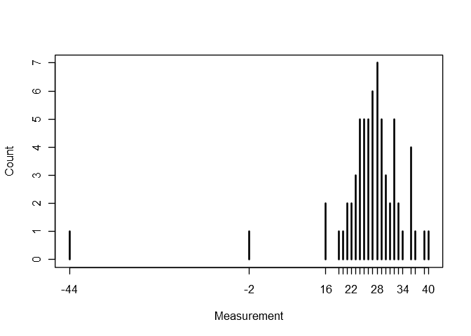
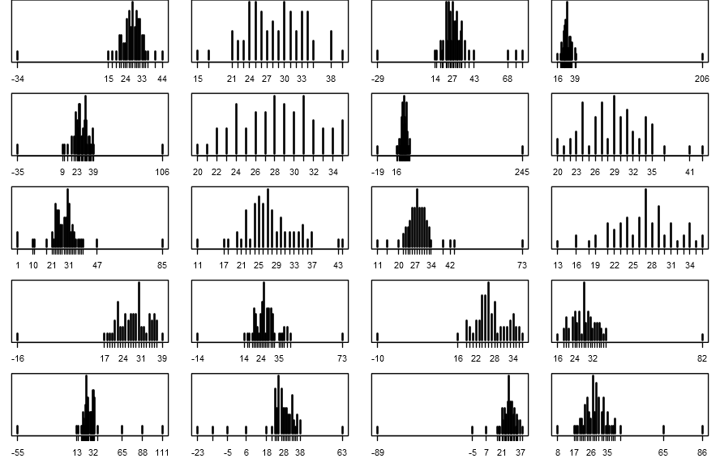
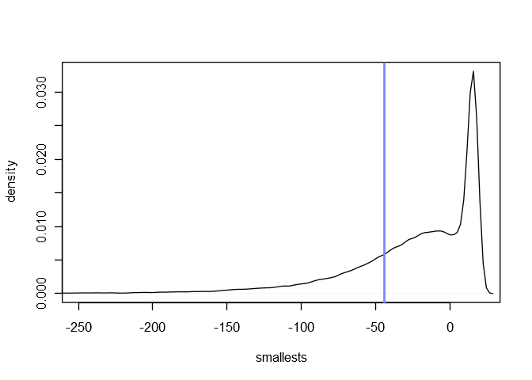
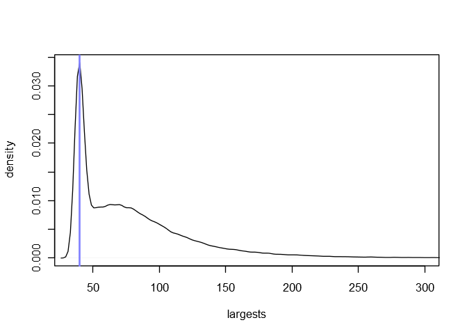
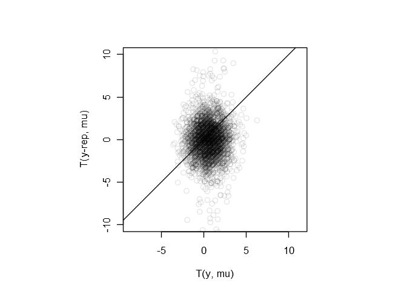

Chapter 6: Model checking
================

Libraries for models and helper functions for plots:

``` r
library(brms)

# The following helper functions are from the 'rethinking' package.
# https://github.com/rmcelreath/rethinking

col.alpha <- function( acol , alpha=0.2 ) {
    acol <- col2rgb(acol)
    acol <- rgb(acol[1]/255,acol[2]/255,acol[3]/255,alpha)
    acol
}

col.desat <- function( acol , amt=0.5 ) {
    acol <- col2rgb(acol)
    ahsv <- rgb2hsv(acol)
    ahsv[2] <- ahsv[2] * amt
    hsv( ahsv[1] , ahsv[2] , ahsv[3] )
}

rangi2 <- col.desat("blue", 0.5)
```

# 6.3 Posterior predictive checking

## Experiment: Comparing Newcomb’s speed of light measurements to the posterior predictive distribution.

Here’s a histogram of Newcomb’s measurements:

``` r
# http://www.stat.columbia.edu/~gelman/book/data/light.asc
light <- c(
    28, 26, 33, 24, 34, -44, 27, 16, 40, -2,
    29, 22, 24, 21, 25, 30, 23, 29, 31, 19,
    24, 20, 36, 32, 36, 28, 25, 21, 28, 29,
    37, 25, 28, 26, 30, 32, 36, 26, 30, 22,
    36, 23, 27, 27, 28, 27, 31, 27, 26, 33,
    26, 32, 32, 24, 39, 28, 24, 25, 32, 25,
    29, 27, 28, 29, 16, 23
)
plot(table(light), xlab = "Measurement", ylab = "Count")
```

<!-- -->

[In
chapter 3](https://github.com/szego/BDA-singalong/blob/master/ch03.md#example-estimating-the-speed-of-light)
we modeled these measurements using a mixture of normal distributions.
Let’s re-fit that model.

``` r
contam_normal <- custom_family(
    name = "contam_normal",
    dpars = c("mu", "sigma", "alpha", "lambda"),
    links = c("identity", "log", "logit", "logm1"),
    type = "real",
    lb = c(NA, 0, 0, 1),
    ub = c(NA, NA, 1, NA)
)

stan_funs <- "
    real contam_normal_lpdf(real y, real mu, real sigma, real alpha, real lambda) {
        return log_mix(alpha, normal_lpdf(y | mu, lambda * sigma), normal_lpdf(y | mu, sigma));
    }
    real contam_normal_rng(real mu, real sigma, real alpha, real lambda) {
        real contam;
        contam = bernoulli_rng(alpha);
        return (1 - contam) * normal_rng(mu, sigma) + contam * normal_rng(mu, lambda * sigma);
    }
"

stanvars <- stanvar(scode = stan_funs, block = "functions")

m6_1 <- brm(
    light ~ 1,
    family = contam_normal,
    prior = prior(student_t(3, 0, 10), class = lambda),
    stanvars = stanvars,
    data = list(light = light),
    iter = 2e4,
    warmup = 1e3,
    chains = 4,
    cores = 4
)
```

``` r
summary(m6_1)
```

    ##  Family: contam_normal 
    ##   Links: mu = identity; sigma = identity; alpha = identity; lambda = identity 
    ## Formula: light ~ 1 
    ##    Data: list(light = light) (Number of observations: 66) 
    ## Samples: 4 chains, each with iter = 20000; warmup = 1000; thin = 1;
    ##          total post-warmup samples = 76000
    ## 
    ## Population-Level Effects: 
    ##           Estimate Est.Error l-95% CI u-95% CI Eff.Sample Rhat
    ## Intercept    27.71      0.66    26.42    29.01      72553 1.00
    ## 
    ## Family Specific Parameters: 
    ##        Estimate Est.Error l-95% CI u-95% CI Eff.Sample Rhat
    ## sigma      5.08      0.49     4.19     6.12      69772 1.00
    ## alpha      0.06      0.04     0.01     0.15      68628 1.00
    ## lambda    11.04      5.65     4.82    25.51      51474 1.00
    ## 
    ## Samples were drawn using sampling(NUTS). For each parameter, Eff.Sample 
    ## is a crude measure of effective sample size, and Rhat is the potential 
    ## scale reduction factor on split chains (at convergence, Rhat = 1).

To compare the Newcomb’s measurements to what we expect to see from our
model we’ll draw samples from the posterior predictive distribution.
We’ve already written a random number generator for the contaminated
normal in Stan, which has been compiled and can be accessed with the
`expose_functions()` command in **brms**.

``` r
expose_functions(m6_1, vectorize = TRUE)
```

For each of our 76000 posterior samples we’ll draw 66 values from the
corresponding contaminated normal distribution.

All of Newcomb’s measurements are integers. I’m not sure exactly how
they were originally calculated and what kind of rounding was used, so a
reasonable compromise in this case is to just go ahead and round the
samples from the contaminated normals to the nearest integers.

Here we plot the first 20 sets of 66 predictions.

``` r
samples <- as.data.frame(m6_1)
predictives <- sapply(
    1:nrow(samples),
    function(i)
        contam_normal_rng(
            rep(samples$b_Intercept[i], 66),
            rep(samples$sigma[i], 66),
            rep(samples$alpha[i], 66),
            rep(samples$lambda[i], 66)
        )
)
predictives_rounded <- round(predictives)
par(mfrow = c(5, 4), mai = c(0.4, 0.15, 0, 0.15))  # 5 rows and 4 columns
for (i in 1:20)
    plot(table(predictives_rounded[,i]), xlab = NULL, ylab = "", yaxt = "n")
```

<!-- -->

Some of these histograms have outliers similar to Newcomb’s smallest
observation, -44.

### Testing the scale of outliers in the data

Now we take the smallest values from each of the 76000 hypothetical
replicated datasets and plot their distribution. We’ll draw a solid blue
line at -44.

``` r
smallests <- apply(predictives_rounded, 2, min)
plot(
    density(smallests, adjust = 0.5),
    xlim = c(-250, max(smallests)),
    xlab = "smallests", ylab = "density",
    main = ""
)
abline(v = -44, col = rangi2, lwd = 2)
```

<!-- -->

Newcomb’s -44 is in the bulk of this distribution, just near the 25th
percentile.

``` r
# proportion of simulated minimum measurements smaller than or equal to -44
mean(smallests <= -44)
```

    ## [1] 0.2519737

The contaminated normal model does appear to capture the variation that
Newcomb observed.

Since our model is a symmetric, we should also check the distribution of
largest values. It’s easy to modify the above code to do this. We’ll
compare the largest simulated observations against Newcomb’s largest
observation, 40.

``` r
largests <- apply(predictives_rounded, 2, max)
plot(
    density(largests, adjust = 0.5),
    xlim = c(min(largests), 300),
    xlab = "largests", ylab = "density",
    main = ""
)
abline(v = 40, col = rangi2, lwd = 2)
```

<!-- -->

The model considers 40 to be one of the most likely largest values. The
corresponding p-value is only slightly more extreme than the one for the
smallest
values.

``` r
# proportion of simulated minimum measurements larger than or equal to 40
mean(largests >= 40)
```

    ## [1] 0.8649868

### Testing for skewness in the bulk of the data

Let’s check the test quantity from the book which is sensitive to
asymmetry in the center of the distribution,

**T(y, mu) = |t10 - mu| - |t90 - mu|,**

where **t10** and **t90** represent the 10th and 90th percentiles of the
data **y**.

We’ll compute this test quantity first using the original data, once for
each posterior sample of **mu**, and then for each pair **(y-rep, mu)**
of hypothetical replicated datasets and posterior samples of **mu**.

``` r
symmetry_stat_data <- sapply(
    1:nrow(samples),
    function(i) {
        q <- quantile(
            light,
            probs = c(0.1, 0.9),
            names = FALSE
        ) - samples$b_Intercept[i]
        diff(abs(q))
    }
)
symmetry_stat_sim <- sapply(
    1:nrow(samples),
    function(i) {
        q <- quantile(
            predictives_rounded[,i],
            probs = c(0.1, 0.9),
            names = FALSE
        ) - samples$b_Intercept[i]
        diff(abs(q))
    }
)

par(pty = "s")
plot(
    symmetry_stat_data[1:3e3],
    symmetry_stat_sim[1:3e3],
    col = col.alpha("black", 0.1),
    ylim = c(-10, 10),
    xlab = "T(y, mu)",
    ylab = "T(y-rep, mu)",
    asp = 1
)
abline(a = 0, b = 1)
```

<!-- -->

This scatterplot shows the first 3000 test quantities of the observed
data versus the first 4000 test quantities of the simulated data.

The corresponding p-value is

**Pr(T(y-rep, mu) \>= T(y, mu) | y),**

which is the proportion of points in the upper-left half of the
scatterplot.

``` r
# p-value
mean(symmetry_stat_sim >= symmetry_stat_data)
```

    ## [1] 0.4478553

> \[This implies that\] any observed asymmetry in the middle of the
> distribution can easily be explained by sampling variation.

-----

[Antonio R. Vargas](https://github.com/szego)

31 Dec 2018
