Selected Exercises from Chapter 2
================

It turned out to be more straightforward to use **rethinking** instead
of **brms** for exercises 1 and 11. Exercises 13 and 21 are done using
**brms**.

``` r
library(rethinking)
library(foreign)
library(tools)
```

## 2.1

We’ll fit a model where the binomial parameter for each of the options
(0 heads, 1 head, 2 heads) is estimated separately.

``` r
m2e1 <- map2stan(
    alist(
        k ~ dbinom(n, p),
        p <- theta[alt],
        theta[alt] ~ dbeta(4, 4)
    ),
    data = list(
        n = as.integer(c(10, 10, 10)),
        k = as.integer(c(0, 1, 2)),
        alt = as.factor(c("a", "b", "c"))
    ),
    start = list(theta = c(0.5, 0.5, 0.5)),
    control = list(adapt_delta = 0.99999),  # somehow necessary
    iter = 1e4,
    warmup = 1e3
)
```

``` r
precis(m2e1, depth = 2)
```

    ## Warning in precis(m2e1, depth = 2): There were 1 divergent iterations during sampling.
    ## Check the chains (trace plots, n_eff, Rhat) carefully to ensure they are valid.

    ##          Mean StdDev lower 0.89 upper 0.89 n_eff Rhat
    ## theta[1] 0.22   0.10       0.07       0.36  4277    1
    ## theta[2] 0.28   0.10       0.11       0.42  5075    1
    ## theta[3] 0.33   0.11       0.15       0.49  5236    1

Now we combine the samples from all three alternatives gives the desired
result.

``` r
theta <- extract.samples(m2e1)$theta
dim(theta) <- nrow(theta)*ncol(theta)
dens(theta, adj = 1, xlim = c(0, 1))
```

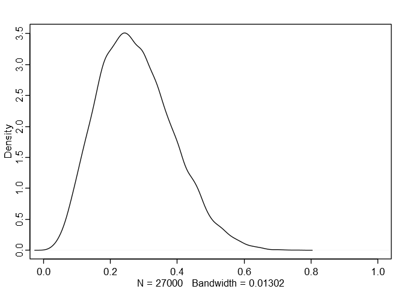<!-- -->

## 2.2

``` r
# (coin 1, coin 2)
prior <- c(1, 1)
likelihood <- c(0.4^2, 0.6^2)  # two tails were spun
posterior <- prior*likelihood
( posterior <- posterior/sum(posterior) )
```

    ## [1] 0.3076923 0.6923077

``` r
probs <- c(0.6, 0.4)
# E[E[additional spins needed | TT, coin] | TT]
sum(posterior/probs)  # note E[additional spins needed | TT, coin] = 1/probs
```

    ## [1] 2.24359

## 2.3

### (a)

Instead of using a normal approximation we’ll simulate 100,000 samples
from the predictive distribution and plot the resulting density.

``` r
probs <- c(1/12, 1/6, 1/4)
prior <- c(0.25, 0.5, 0.25)
prob_samples <- sample(probs, 1e5, replace = TRUE, prob = prior)
predictive <- rbinom(1e5, 1000, prob_samples)
# rethinking::dens()
dens(
    predictive,
    xlab = "Number of sixes rolled out of 1000",
    main = "Predictive distribution"
)
```

<!-- -->

``` r
quantile(predictive, probs = c(0.05, 0.25, 0.5, 0.75, 0.95))
```

    ##  5% 25% 50% 75% 95% 
    ##  76 106 167 217 261

## 2.9

### (a)

``` r
dbeta2 <- function(x, mean, sd, log = FALSE)
    dbeta(
        x,
        shape1 = mean*(mean - mean^2 - sd^2)/sd^2,
        shape2 = (1 - mean)*(mean - mean^2 - sd^2)/sd^2,
        log = log
    )
curve(dbeta2(x, mean = 0.6, sd = 0.3), from = 0, to = 1)
```

<!-- -->

``` r
curve(
    dbinom(650, 1000, x)*dbeta2(x, 0.6, 0.3),
    from = 0.55, to = 0.75,
    xlab = "theta", ylab = "posterior density",
    yaxt = "n"
)
```

<!-- -->

## 2.10

### (a)

It’s equally likely that we’ll see any of the cars numbered 1 to N, so
our likelihood is uniform on (1, 2, …, N). That is, p(203|N) = 1/N. Our
posterior for N|203 is then proportional to **(99/100)^(N-1) / N** for N
\>= 203.

### (b)

``` r
posterior <- function(n) exp(-log(100) + (n-1)*log(99/100) - log(n))
n.seq <- 203:1e5
coef <- 1/sum(posterior(n.seq))
plot(203:1e3, coef*posterior(203:1e3), type = "l", xlab = "N", ylab = "posterior")
```

<!-- -->

``` r
# posterior mean
( mean <- sum(coef*(n.seq)*posterior(n.seq)) )
```

    ## [1] 279.0885

``` r
# posterior standard deviation
sqrt(sum(coef*(n.seq)^2*posterior(n.seq)) - mean^2)
```

    ## [1] 79.96458

### (c)

The Fisher information for N is **E\[(d(-log N)/dN)^2 | N\] = 1/N^2**,
so Jeffrey’s principle leads to the noninformative prior **p(N) = 1/N**.
Thus our posterior is proportional to 1/N^2 for N \>= 203.

``` r
posterior <- function(n) 1/n^2
coef <- 1/(pi^2/6 - sum(posterior(1:202)))
plot(203:1e3, coef*posterior(203:1e3), type = "l", xlab = "N", ylab = "posterior")
```

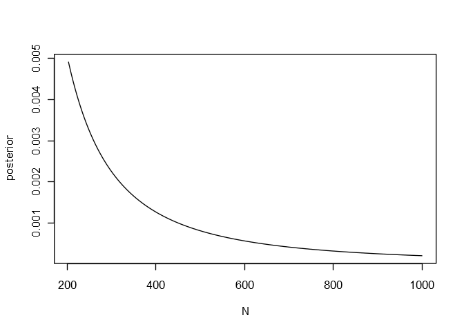<!-- -->

The mean and standard deviation of this distribution are infinite.

## 2.11

### (a, b)

Instead of using a grid model, we’ll use **rethinking** to obtain the
posterior samples.

``` r
m2e11 <- map2stan(
    alist(
        y ~ dcauchy(theta, 1),
        theta ~ dunif(0, 100)
    ),
    data = list(y = c(43, 44, 45, 46.5, 47.5)),
    iter = 6e3,
    warmup = 1e3,
    chains = 4,
    cores = 4
)
```

``` r
precis(m2e11)
```

    ##        Mean StdDev lower 0.89 upper 0.89 n_eff Rhat
    ## theta 45.08   0.98      43.47       46.6  6574    1

``` r
theta <- extract.samples(m2e11)$theta
dens(theta, xlab = "theta", main = "Posterior for theta")
```

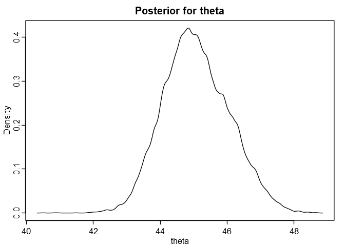<!-- -->

### (c)

``` r
predictive <- rcauchy(1e3, theta)
hist(predictive, breaks = 500, xlim = c(0, 100), xlab = "y", main = "Predictive distribution")
```

<!-- -->

## 2.13

``` r
airlines <- data.frame(
    year = as.integer(c(1976, 1977, 1978, 1979, 1980, 1981, 1982, 1983, 1984, 1985)),
    fatal_accidents = c(24, 25, 31, 31, 22, 21, 26, 20, 16, 22),
    passenger_deaths = c(734, 516, 754, 877, 814, 362, 764, 809, 223, 1066),
    death_rate = c(0.19, 0.12, 0.15, 0.16, 0.14, 0.06, 0.13, 0.13, 0.03, 0.15)
)
```

This is the first problem where I can use **brms** easily.

``` r
library(brms)
library(coda)

# The following helper functions are from the 'rethinking' package.

col.alpha <- function( acol , alpha=0.2 ) {
    acol <- col2rgb(acol)
    acol <- rgb(acol[1]/255,acol[2]/255,acol[3]/255,alpha)
    acol
}

col.desat <- function( acol , amt=0.5 ) {
    acol <- col2rgb(acol)
    ahsv <- rgb2hsv(acol)
    ahsv[2] <- ahsv[2] * amt
    hsv( ahsv[1] , ahsv[2] , ahsv[3] )
}

rangi2 <- col.desat("blue", 0.5)
```

### (a)

Just using an improper (flat) prior here.

``` r
m2e_13_1 <- brm(
    fatal_accidents ~ 1,
    family = poisson(),
    data = airlines
)
```

``` r
summary(m2e_13_1)
```

    ##  Family: poisson 
    ##   Links: mu = log 
    ## Formula: fatal_accidents ~ 1 
    ##    Data: airlines (Number of observations: 10) 
    ## Samples: 4 chains, each with iter = 2000; warmup = 1000; thin = 1;
    ##          total post-warmup samples = 4000
    ## 
    ## Population-Level Effects: 
    ##           Estimate Est.Error l-95% CI u-95% CI Eff.Sample Rhat
    ## Intercept     3.16      0.07     3.04     3.29       1574 1.00
    ## 
    ## Samples were drawn using sampling(NUTS). For each parameter, Eff.Sample 
    ## is a crude measure of effective sample size, and Rhat is the potential 
    ## scale reduction factor on split chains (at convergence, Rhat = 1).

``` r
theta <- exp(as.data.frame(m2e_13_1)$b_Intercept)
plot(density(theta), xlab = "theta", ylab = "density", main = "Posterior for theta")
```

<!-- -->

#### Predicting the number of accidents in 1986

``` r
predictive <- rpois(1e5, theta)
HPDinterval(as.mcmc(predictive))[1,]
```

    ## lower upper 
    ##    13    33

### (b)

``` r
# add a column containing how many hundred billion passenger miles were flown
airlines$miles <- airlines$passenger_deaths/airlines$death_rate * 1e-3
airlines
```

    ##    year fatal_accidents passenger_deaths death_rate    miles
    ## 1  1976              24              734       0.19 3.863158
    ## 2  1977              25              516       0.12 4.300000
    ## 3  1978              31              754       0.15 5.026667
    ## 4  1979              31              877       0.16 5.481250
    ## 5  1980              22              814       0.14 5.814286
    ## 6  1981              21              362       0.06 6.033333
    ## 7  1982              26              764       0.13 5.876923
    ## 8  1983              20              809       0.13 6.223077
    ## 9  1984              16              223       0.03 7.433333
    ## 10 1985              22             1066       0.15 7.106667

We’ll fit the model on the log scale using an adaptive normal prior on
the distribution of rates.

``` r
m2e_13_2 <- brm(
    fatal_accidents ~ (1 | year) + offset(log(miles)),
    family = poisson(),
    data = airlines,
    iter = 9e3,
    warmup = 1e3,
    chains = 4,
    cores = 4,
    control = list(adapt_delta = 0.99)
)
```

``` r
summary(m2e_13_2)
```

    ##  Family: poisson 
    ##   Links: mu = log 
    ## Formula: fatal_accidents ~ (1 | year) + offset(log(miles)) 
    ##    Data: airlines (Number of observations: 10) 
    ## Samples: 4 chains, each with iter = 9000; warmup = 1000; thin = 1;
    ##          total post-warmup samples = 32000
    ## 
    ## Group-Level Effects: 
    ## ~year (Number of levels: 10) 
    ##               Estimate Est.Error l-95% CI u-95% CI Eff.Sample Rhat
    ## sd(Intercept)     0.33      0.14     0.12     0.67       7723 1.00
    ## 
    ## Population-Level Effects: 
    ##           Estimate Est.Error l-95% CI u-95% CI Eff.Sample Rhat
    ## Intercept     1.42      0.13     1.15     1.68       7987 1.00
    ## 
    ## Samples were drawn using sampling(NUTS). For each parameter, Eff.Sample 
    ## is a crude measure of effective sample size, and Rhat is the potential 
    ## scale reduction factor on split chains (at convergence, Rhat = 1).

``` r
samples <- as.mcmc(m2e_13_2, combine_chains = TRUE)
year_posts <- sapply(3:12, function(i) exp(samples[,1] + samples[,i]))
HPDIs <- apply(year_posts, 2, function(x) HPDinterval(as.mcmc(x)))
data.frame(
    year = airlines$year,
    estimate = round(apply(year_posts, 2, mean), 2),
    sd = round(apply(year_posts, 2, sd), 2),
    HPDI_95 = apply(HPDIs, 2, function(x) paste(round(x[1], 2), "to", round(x[2], 2)))
)
```

    ##    year estimate   sd      HPDI_95
    ## 1  1976     5.46 1.06 3.62 to 7.65
    ## 2  1977     5.23 0.97 3.49 to 7.19
    ## 3  1978     5.53 0.96 3.79 to 7.47
    ## 4  1979     5.20 0.87 3.61 to 6.96
    ## 5  1980     3.93 0.69 2.58 to 5.26
    ## 6  1981     3.72 0.67 2.44 to 5.04
    ## 7  1982     4.36 0.74 2.99 to 5.84
    ## 8  1983     3.54 0.65 2.27 to 4.77
    ## 9  1984     2.79 0.60    1.69 to 4
    ## 10 1985     3.43 0.61 2.28 to 4.64

These are the Bayes-adjusted fatal accident rates (fatal accidents per
hundred billion passenger miles) for each year.

#### Predicting the number of accidents in 1986

There a few ways we could estimate the number of fatal accidents for
1986.

The best place to start would be to compare the two models we’ve fit.
We’ll estimate their predictive power using [leave-one-out cross
validation](https://link.springer.com/article/10.1007/s11222-016-9696-4).

``` r
loo(m2e_13_1, m2e_13_2, reloo = TRUE)
```

    ##                      LOOIC   SE
    ## m2e_13_1             60.37 3.74
    ## m2e_13_2             73.40 3.96
    ## m2e_13_1 - m2e_13_2 -13.03 2.85

The LOOIC estimates that the first model, which didn’t model the
different years separately, certainly has more predictive power than the
second model. We can be confident in our earlier estimate of a 95%
prediction interval of 14 to 33 accidents.

One benefit of the second model is that it explicitly models variation
of the fatal accident rates between years. It estimated the distribution
of log accident rates to have a mean of 1.42 and a standard deviation of
0.34. We can use this uncertainty to construct a posterior for the
accident rate of a new year.

``` r
# Here, samples[,1] contains the samples for the mean, and
# samples[,2] contains the samples for the standard deviation.
log_accident_rate <- rnorm(nrow(samples), mean = samples[,1], sd = samples[,2])
accident_rate <- exp(log_accident_rate)
plot(
    density(accident_rate),
    xlim = c(0, 20),
    xlab = "fatal accident rate", ylab = "density",
    main = "Posterior for fatal accident rate"
)
```

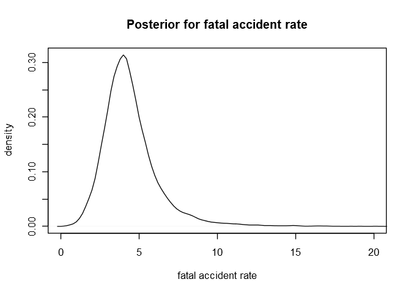<!-- -->

We can then use this posterior to create a predictive distribution.

``` r
predictive <- rpois(length(accident_rate), 8*accident_rate)
plot(
    table(predictive)/length(predictive),
    xlim = c(0, 100),
    xlab = "number of fatal accidents",
    ylab = "probability"
)
```

<!-- -->

And here’s the 95% predictive interval this gives us:

``` r
HPDinterval(as.mcmc(predictive))[1,]
```

    ## lower upper 
    ##     8    65

Clearly this is much more conservative than the last estimate. This is a
good thing\!

Now, we have ignored the fact that our model treats the data from each
year as exchangeable. We might suspect, or the keen eye might have
noticed, that the fatal accident rates seem to have decreased over
time.

``` r
plot(1976:1985, apply(year_posts, 2, mean), xlab = "year", ylab = "fatal accident rate", ylim = c(1.5, 8))
for(year in 1976:1985)
    lines(x = c(year, year), y = HPDIs[,year - 1975])
```

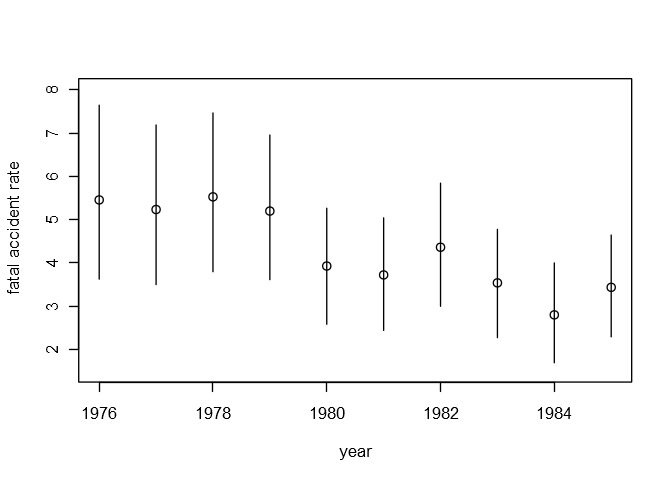<!-- -->

Neither of the previous models have taken this into account. The
simplest way we could do so is to assume that the accident rate will be
about the same as it was the last year, in 1985, obtaining the following
estimate.

``` r
predict(m2e_13_2, newdata = list(year = 1985, miles = 8))
```

    ##      Estimate Est.Error Q2.5 Q97.5
    ## [1,] 27.51291   7.21389   15    43

To squeeze a little more blood from this rock, we could even fit a
regression line over these rates, taking into account the errors in
their estimates. We’ll fit it on the log scale to take into account that
the rates should be positive.

``` r
log_year_posts <- sapply(3:12, function(i) samples[,1] + samples[,i])
log_HPDIs <- apply(log_year_posts, 2, function(x) HPDinterval(as.mcmc(x)))
log_estimates <- data.frame(
    year = airlines$year,
    log_estimate = round(apply(log_year_posts, 2, mean), 3),
    sd = round(apply(log_year_posts, 2, sd), 3),
    HPDI_95 = apply(HPDIs, 2, function(x) paste(round(x[1], 2), "to", round(x[2], 2)))
)
log_estimates$year_s <- (log_estimates$year - mean(log_estimates$year))/sd(log_estimates$year)
log_estimates
```

    ##    year log_estimate    sd      HPDI_95     year_s
    ## 1  1976        1.678 0.191 3.62 to 7.65 -1.4863011
    ## 2  1977        1.638 0.183 3.49 to 7.19 -1.1560120
    ## 3  1978        1.695 0.173 3.79 to 7.47 -0.8257228
    ## 4  1979        1.634 0.167 3.61 to 6.96 -0.4954337
    ## 5  1980        1.352 0.176 2.58 to 5.26 -0.1651446
    ## 6  1981        1.297 0.182 2.44 to 5.04  0.1651446
    ## 7  1982        1.458 0.169 2.99 to 5.84  0.4954337
    ## 8  1983        1.246 0.186 2.27 to 4.77  0.8257228
    ## 9  1984        1.004 0.219    1.69 to 4  1.1560120
    ## 10 1985        1.217 0.181 2.28 to 4.64  1.4863011

``` r
plot(1976:1985, apply(log_year_posts, 2, mean), xlab = "year", ylab = "log fatal accident rate", ylim = c(0.5, 2.25))
for(year in 1976:1985)
    lines(x = c(year, year), y = log_HPDIs[,year - 1975])
```

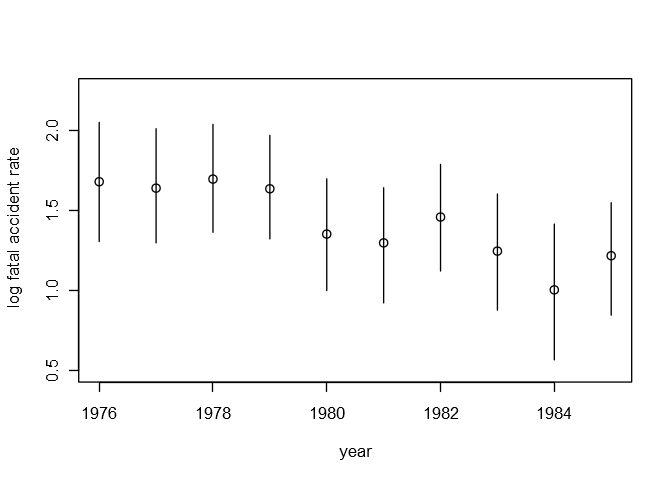<!-- -->

``` r
m2e_13_3 <- brm(
    log_estimate | se(sd, sigma = TRUE) ~ year_s,
    data = log_estimates,
    iter = 9e3,
    warmup = 1e3,
    chains = 4,
    cores = 4
)
```

``` r
summary(m2e_13_3)
```

    ##  Family: gaussian 
    ##   Links: mu = identity; sigma = identity 
    ## Formula: log_estimate | se(sd, sigma = TRUE) ~ year_s 
    ##    Data: log_estimates (Number of observations: 10) 
    ## Samples: 4 chains, each with iter = 9000; warmup = 1000; thin = 1;
    ##          total post-warmup samples = 32000
    ## 
    ## Population-Level Effects: 
    ##           Estimate Est.Error l-95% CI u-95% CI Eff.Sample Rhat
    ## Intercept     1.43      0.07     1.30     1.56      22184 1.00
    ## year_s       -0.20      0.07    -0.34    -0.07      22451 1.00
    ## 
    ## Family Specific Parameters: 
    ##       Estimate Est.Error l-95% CI u-95% CI Eff.Sample Rhat
    ## sigma     0.08      0.06     0.00     0.24      22705 1.00
    ## 
    ## Samples were drawn using sampling(NUTS). For each parameter, Eff.Sample 
    ## is a crude measure of effective sample size, and Rhat is the potential 
    ## scale reduction factor on split chains (at convergence, Rhat = 1).

Here’s what the regression line and its 89% prediction interval look
like against the estimated fatal accident rates.

``` r
post <- as.data.frame(m2e_13_3)
year.seq <- seq(from = 1.1*min(log_estimates$year_s), to = 1.1*max(log_estimates$year_s), length.out = 30)
link <- sapply(year.seq, function(y) exp(post$b_Intercept + y*post$b_year_s))
link.mu <- apply(link, 2, mean)
link.PI <- apply(link, 2, function(x) HPDinterval(as.mcmc(x), prob = 0.89))

plot(
    log_estimates$year_s, apply(year_posts, 2, mean),
    xlab = "year", ylab = "fatal accident rate",
    ylim = c(1.5, 8),
    xaxt = "n"
)

for(i in 1:10)
    lines(x = c(log_estimates$year_s[i], log_estimates$year_s[i]), y = HPDIs[,i])

lines(year.seq, link.mu)

polygon(
    c(year.seq, rev(year.seq)), c(link.PI[1,], rev(link.PI[2,])),
    col = col.alpha("black", 0.15), border = NA
)

at <- log_estimates$year_s
labels <- log_estimates$year
axis( side=1 , at=at , labels=labels )
```

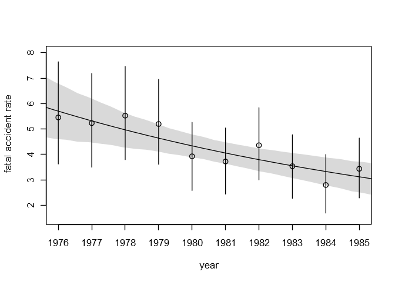<!-- -->

Using the prediction from this regression we can compute a posterior for
the accident rate in 1986 by simulating a normal distribution with the
sampled means and standard deviations.

``` r
year <- (1986 - mean(log_estimates$year))/sd(log_estimates$year)
mu <- post$b_Intercept + year*post$b_year_s
log_accident_rate <- rnorm(length(mu), mean = mu, sd = post$sigma)
accident_rate <- exp(log_accident_rate)
plot(
    density(accident_rate),
    xlab = "fatal accident rate", ylab = "density",
    main = "Posterior for 1986 fatal accident rate"
)
```

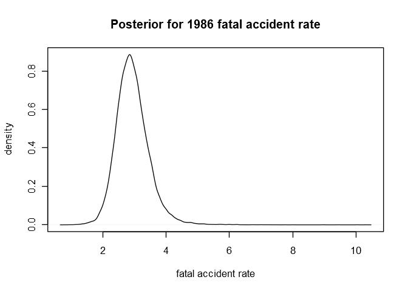<!-- -->

And we’ll compute the corresponding posterior predictive distribution.

``` r
predictive <- rpois(length(accident_rate), 8*accident_rate)
plot(
    table(predictive)/length(predictive),
    xlim = c(0, 50),
    xlab = "number of fatal accidents",
    ylab = "probability",
    main = "Posterior predictive distribution for number of fatal accidents in 1986"
)
```

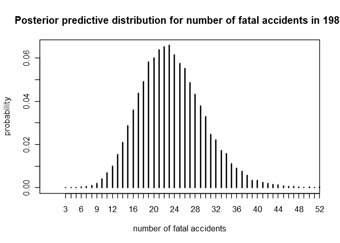<!-- -->

This predictive distribution yields the following estimate and
corresponding 95% prediction interval.

``` r
interval <- HPDinterval(as.mcmc(predictive))[1,]
data.frame(
    year = 1986,
    fatal_accidents = round(mean(predictive)),
    sd = round(sd(predictive), 2),
    HPDI_95 = paste(interval[1], "to", interval[2])
)
```

    ##   year fatal_accidents   sd  HPDI_95
    ## 1 1986              24 6.45 11 to 35

Compare this with the predictive interval from part (a).

### (c)

Now we model the number of passenger deaths as a Poisson random
variable, again using an improper prior.

``` r
m2e_13_4 <- brm(
    passenger_deaths ~ 1,
    family = poisson(),
    data = airlines
)
```

``` r
summary(m2e_13_4)
```

    ##  Family: poisson 
    ##   Links: mu = log 
    ## Formula: passenger_deaths ~ 1 
    ##    Data: airlines (Number of observations: 10) 
    ## Samples: 4 chains, each with iter = 2000; warmup = 1000; thin = 1;
    ##          total post-warmup samples = 4000
    ## 
    ## Population-Level Effects: 
    ##           Estimate Est.Error l-95% CI u-95% CI Eff.Sample Rhat
    ## Intercept     6.54      0.01     6.52     6.56       1484 1.00
    ## 
    ## Samples were drawn using sampling(NUTS). For each parameter, Eff.Sample 
    ## is a crude measure of effective sample size, and Rhat is the potential 
    ## scale reduction factor on split chains (at convergence, Rhat = 1).

``` r
theta <- exp(as.data.frame(m2e_13_4)$b_Intercept)
plot(density(theta), xlab = "theta", ylab = "density", main = "Posterior for theta")
```

<!-- -->

#### Predicting the number of passenger deaths in 1986

``` r
predictive <- rpois(1e5, theta)
HPDinterval(as.mcmc(predictive))[1,]
```

    ## lower upper 
    ##   639   746

### (d)

``` r
m2e_13_5 <- brm(
    passenger_deaths ~ (1 | year) + offset(log(miles)),
    family = poisson(),
    data = airlines,
    iter = 9e3,
    warmup = 1e3,
    chains = 4,
    cores = 4,
    control = list(adapt_delta = 0.99)
)
```

``` r
summary(m2e_13_5)
```

    ##  Family: poisson 
    ##   Links: mu = log 
    ## Formula: passenger_deaths ~ (1 | year) + offset(log(miles)) 
    ##    Data: airlines (Number of observations: 10) 
    ## Samples: 4 chains, each with iter = 9000; warmup = 1000; thin = 1;
    ##          total post-warmup samples = 32000
    ## 
    ## Group-Level Effects: 
    ## ~year (Number of levels: 10) 
    ##               Estimate Est.Error l-95% CI u-95% CI Eff.Sample Rhat
    ## sd(Intercept)     0.65      0.19     0.40     1.10       2763 1.00
    ## 
    ## Population-Level Effects: 
    ##           Estimate Est.Error l-95% CI u-95% CI Eff.Sample Rhat
    ## Intercept     4.72      0.21     4.29     5.16       2283 1.00
    ## 
    ## Samples were drawn using sampling(NUTS). For each parameter, Eff.Sample 
    ## is a crude measure of effective sample size, and Rhat is the potential 
    ## scale reduction factor on split chains (at convergence, Rhat = 1).

``` r
samples <- as.mcmc(m2e_13_5, combine_chains = TRUE)
year_posts <- sapply(3:12, function(i) exp(samples[,1] + samples[,i]))
HPDIs <- apply(year_posts, 2, function(x) HPDinterval(as.mcmc(x)))
data.frame(
    year = airlines$year,
    estimate = round(apply(year_posts, 2, mean), 2),
    sd = round(apply(year_posts, 2, sd), 2),
    HPDI_95 = apply(HPDIs, 2, function(x) paste(round(x[1], 2), "to", round(x[2], 2)))
)
```

    ##    year estimate   sd          HPDI_95
    ## 1  1976   189.58 6.99 176.44 to 203.75
    ## 2  1977   119.98 5.27 109.68 to 130.21
    ## 3  1978   149.86 5.44 139.18 to 160.35
    ## 4  1979   159.83 5.38 149.53 to 170.66
    ## 5  1980   139.87 4.87 130.34 to 149.49
    ## 6  1981    60.31 3.13   54.29 to 66.51
    ## 7  1982   129.93 4.70  120.8 to 139.15
    ## 8  1983   129.95 4.51 121.42 to 139.14
    ## 9  1984    30.50 1.99   26.56 to 34.34
    ## 10 1985   149.87 4.60  141.09 to 159.1

These are the Bayes-adjusted passenger death rates (passenger deaths per
hundred billion passenger miles) for each year.

#### Predicting the number of accidents in 1986

We again compare our models using LOO.

``` r
loo(m2e_13_4, m2e_13_5, reloo = TRUE)
```

    ##                       LOOIC     SE
    ## m2e_13_4            1143.25 481.33
    ## m2e_13_5             304.54 106.85
    ## m2e_13_4 - m2e_13_5  838.71 398.54

In this case the model which estimates separate effects for each year is
expected to have FAR more predictive power than the first model. Here is
the estimated distribution of passenger death
rates:

``` r
death_rate <- exp(rnorm(nrow(samples), mean = samples[,1], sd = samples[,2]))
plot(
    density(death_rate[death_rate < 800]),  # remove huge outliers for the plot
    xlim = c(0, 600),
    xlab = "passenger death rate", ylab = "density",
    main = "Posterior for passenger death rate"
)
```

<!-- -->

We then use this posterior to create a predictive distribution.

``` r
predictive <- rpois(length(death_rate), 8*death_rate)
plot(
    density(predictive[predictive < 5300]),  # remove huge outliers for the plot
    xlim = c(0, 4000),
    xlab = "number of passenger deaths",
    ylab = "density",
    main = "Predictive distribution for passenger deaths in 1986"
)
```

<!-- -->

And here’s the 95% predictive interval this gives us:

``` r
HPDinterval(as.mcmc(predictive))[1,]
```

    ## lower upper 
    ##    75  2845

This seems like the best estimate we can get with the data we have.
There isn’t an obvious trend in the death rates, so we may as well
assume that the years are
exchangeable.

``` r
plot(1976:1985, apply(year_posts, 2, mean), xlab = "year", ylab = "passenger death rate", ylim = c(25, 205))
for(year in 1976:1985)
    lines(x = c(year, year), y = HPDIs[,year - 1975])
```

<!-- -->

### (e)

It’s arguably less reasonable to model the number of passenger deaths
using a Poisson likelihood because they generally require an accident to
happen first. Modeling the numbers of deaths and the occurrences of
accidents together would be a better approach.

## 2.21

The data for this exercise can be downloaded from [Gelman’s
website](http://www.stat.columbia.edu/~gelman/book/data/).

The only columns we need from the Pew Research Center data are “ideo”
and “state”.

``` r
pew <- read.dta("pew_research_center_june_elect_wknd_data.dta")
pew <- data.frame(ideo = pew$ideo, state = pew$state)
pew <- pew[complete.cases(pew) & pew$state != "hawaii" & pew$state != "alaska",]
pew <- droplevels(pew)
head(pew)
```

    ##           ideo         state
    ## 1      liberal massachusetts
    ## 2     moderate massachusetts
    ## 3 conservative massachusetts
    ## 4      liberal massachusetts
    ## 5     moderate massachusetts
    ## 6     moderate massachusetts

We’ll tally each respondent identifying as “very liberal” within each
state.

``` r
liberals <- data.frame(
    very_liberal = as.integer(by(pew, pew$state, function(x) sum(grepl("very liberal", x$ideo)))),
    state = levels(pew$state),
    total_surveyed = as.integer(by(pew, pew$state, function(x) nrow(x)))
)
liberals
```

    ##    very_liberal          state total_surveyed
    ## 1            30        alabama            617
    ## 2            28        arizona            533
    ## 3             7       arkansas            304
    ## 4           179     california           2809
    ## 5            27       colorado            465
    ## 6            14    connecticut            391
    ## 7             7       delaware            116
    ## 8             7  washington dc             62
    ## 9            65        florida           1717
    ## 10           42        georgia           1015
    ## 11           14          idaho            139
    ## 12           77       illinois           1116
    ## 13           29        indiana            817
    ## 14           17           iowa            440
    ## 15           22         kansas            325
    ## 16           17       kentucky            514
    ## 17           23      louisiana            591
    ## 18            9          maine            154
    ## 19           24       maryland            587
    ## 20           46  massachusetts            681
    ## 21           42       michigan            989
    ## 22           32      minnesota            708
    ## 23           16    mississippi            261
    ## 24           27       missouri            770
    ## 25            2        montana             89
    ## 26            6       nebraska            208
    ## 27            8         nevada            199
    ## 28            1  new hampshire            160
    ## 29           34     new jersey            857
    ## 30            8     new mexico            215
    ## 31          104       new york           1666
    ## 32           44 north carolina           1041
    ## 33            2   north dakota            120
    ## 34           62           ohio           1389
    ## 35           27       oklahoma            423
    ## 36           40         oregon            464
    ## 37           54   pennsylvania           1564
    ## 38            6   rhode island            130
    ## 39           16 south carolina            455
    ## 40            5   south dakota             93
    ## 41           32      tennessee            735
    ## 42           74          texas           1895
    ## 43           15           utah            278
    ## 44            8        vermont            114
    ## 45           36       virginia            884
    ## 46           50     washington            657
    ## 47            4  west virginia            267
    ## 48           30      wisconsin            740
    ## 49            1        wyoming             29

And all we need from the election results data are the state names and
Obama’s vote shares.

``` r
election <- read.csv("2008ElectionResult.csv")
election <- election[election$state != "Alaska" & election$state != "Hawaii",]
election$state <- as.character(election$state)
election[election$state == "District of Columbia", 1] <- "washington dc"
election$state <- as.factor(tolower(election$state))
election <- droplevels(election)
election <- data.frame(state = election$state, vote_Obama_pct = election$vote_Obama_pct)
election$stateabbr <- sapply(
    as.character(election$state),
    function(s) ifelse(s == "washington dc", "DC", state.abb[grep(toTitleCase(s), state.name)][1])
)
head(election)
```

    ##         state vote_Obama_pct stateabbr
    ## 1     alabama           38.8        AL
    ## 2     arizona           45.0        AZ
    ## 3    arkansas           38.8        AR
    ## 4  california           60.9        CA
    ## 5    colorado           53.5        CO
    ## 6 connecticut           60.5        CT

### The model

We used a Poisson likelihood in the chapter, but pulling someone out of
the population at random and asking them “Do you identify as ‘very
liberal’?” just feels more like a Bernoulli trial to me. Maybe it’s
ill-advised, but I’ll opt for a binomial likelihood instead. Since the
observed proportions of very-liberals in each state are small (\<0.1),
the corresponding Poisson distributions would approximate our Binomial
distributions. So this choice probably won’t affect the inferences much
anyway.

Similar to what we did in exercise 2.13, we’ll fit the model on the
*logistic* scale using an adaptive normal prior on the distribution of
proportions.

``` r
m2e_21_1 <- brm(
    very_liberal | trials(total_surveyed) ~ (1 | state),
    family = binomial("logit"),
    data = liberals,
    iter = 9e3,
    warmup = 1e3,
    chains = 4,
    cores = 4
)
```

``` r
summary(m2e_21_1)
```

    ##  Family: binomial 
    ##   Links: mu = logit 
    ## Formula: very_liberal | trials(total_surveyed) ~ (1 | state) 
    ##    Data: liberals (Number of observations: 49) 
    ## Samples: 4 chains, each with iter = 9000; warmup = 1000; thin = 1;
    ##          total post-warmup samples = 32000
    ## 
    ## Group-Level Effects: 
    ## ~state (Number of levels: 49) 
    ##               Estimate Est.Error l-95% CI u-95% CI Eff.Sample Rhat
    ## sd(Intercept)     0.28      0.05     0.19     0.39      10689 1.00
    ## 
    ## Population-Level Effects: 
    ##           Estimate Est.Error l-95% CI u-95% CI Eff.Sample Rhat
    ## Intercept    -3.03      0.05    -3.14    -2.93      19348 1.00
    ## 
    ## Samples were drawn using sampling(NUTS). For each parameter, Eff.Sample 
    ## is a crude measure of effective sample size, and Rhat is the potential 
    ## scale reduction factor on split chains (at convergence, Rhat = 1).

``` r
samples <- as.mcmc(m2e_21_1, combine_chains = TRUE)
state_posts <- sapply(3:51, function(i) inv_logit_scaled(samples[,1] + samples[,i]))
HPDIs <- apply(state_posts, 2, function(x) HPDinterval(as.mcmc(x)))
estimates <- data.frame(
    state = levels(liberals$state),
    proportion = round(apply(state_posts, 2, mean), 4),
    sd = round(apply(state_posts, 2, sd), 4),
    HPDI_95 = apply(HPDIs, 2, function(x) paste(round(x[1], 2), "to", round(x[2], 2)))
)
estimates
```

    ##             state proportion     sd      HPDI_95
    ## 1         alabama     0.0478 0.0071 0.03 to 0.06
    ## 2         arizona     0.0504 0.0077 0.04 to 0.07
    ## 3        arkansas     0.0357 0.0073 0.02 to 0.05
    ## 4      california     0.0621 0.0044 0.05 to 0.07
    ## 5        colorado     0.0536 0.0083 0.04 to 0.07
    ## 6     connecticut     0.0407 0.0072 0.03 to 0.06
    ## 7        delaware     0.0509 0.0114 0.03 to 0.07
    ## 8         florida     0.0393 0.0042 0.03 to 0.05
    ## 9         georgia     0.0426 0.0056 0.03 to 0.05
    ## 10          idaho     0.0659 0.0142 0.04 to 0.09
    ## 11       illinois     0.0645 0.0068 0.05 to 0.08
    ## 12        indiana     0.0387 0.0057 0.03 to 0.05
    ## 13           iowa     0.0420 0.0073 0.03 to 0.06
    ## 14         kansas     0.0579 0.0100 0.04 to 0.08
    ## 15       kentucky     0.0384 0.0066 0.03 to 0.05
    ## 16      louisiana     0.0416 0.0066 0.03 to 0.05
    ## 17          maine     0.0509 0.0108 0.03 to 0.07
    ## 18       maryland     0.0429 0.0067 0.03 to 0.06
    ## 19  massachusetts     0.0614 0.0081 0.05 to 0.08
    ## 20       michigan     0.0434 0.0056 0.03 to 0.05
    ## 21      minnesota     0.0456 0.0065 0.03 to 0.06
    ## 22    mississippi     0.0537 0.0098 0.04 to 0.07
    ## 23       missouri     0.0386 0.0059 0.03 to 0.05
    ## 24        montana     0.0417 0.0101 0.02 to 0.06
    ## 25       nebraska     0.0399 0.0084 0.02 to 0.06
    ## 26         nevada     0.0442 0.0092 0.03 to 0.06
    ## 27  new hampshire     0.0341 0.0082 0.02 to 0.05
    ## 28     new jersey     0.0415 0.0057 0.03 to 0.05
    ## 29     new mexico     0.0429 0.0087 0.03 to 0.06
    ## 30       new york     0.0600 0.0055 0.05 to 0.07
    ## 31 north carolina     0.0433 0.0055 0.03 to 0.05
    ## 32   north dakota     0.0388 0.0092 0.02 to 0.06
    ## 33           ohio     0.0450 0.0050 0.04 to 0.05
    ## 34       oklahoma     0.0570 0.0092 0.04 to 0.08
    ## 35         oregon     0.0722 0.0105 0.05 to 0.09
    ## 36   pennsylvania     0.0367 0.0043 0.03 to 0.05
    ## 37   rhode island     0.0467 0.0104 0.03 to 0.07
    ## 38 south carolina     0.0401 0.0070 0.03 to 0.05
    ## 39   south dakota     0.0488 0.0115 0.03 to 0.07
    ## 40      tennessee     0.0444 0.0064 0.03 to 0.06
    ## 41          texas     0.0401 0.0041 0.03 to 0.05
    ## 42           utah     0.0502 0.0094 0.03 to 0.07
    ## 43        vermont     0.0538 0.0120 0.03 to 0.08
    ## 44       virginia     0.0423 0.0058 0.03 to 0.05
    ## 45     washington     0.0676 0.0088 0.05 to 0.08
    ## 46  washington dc     0.0598 0.0148 0.03 to 0.09
    ## 47  west virginia     0.0332 0.0074 0.02 to 0.05
    ## 48      wisconsin     0.0423 0.0062 0.03 to 0.05
    ## 49        wyoming     0.0464 0.0122 0.02 to 0.07

These are the Bayes-adjusted proportions of very-liberals in each state,
along with the standard deviations and 95% density intervals of their
posteriors.

``` r
# lowest estimated proportion of very-liberals
estimates[which.min(estimates$proportion),]
```

    ##            state proportion     sd      HPDI_95
    ## 47 west virginia     0.0332 0.0074 0.02 to 0.05

``` r
# highest estimated proportion of very-liberals
estimates[which.max(estimates$proportion),]
```

    ##     state proportion     sd      HPDI_95
    ## 35 oregon     0.0722 0.0105 0.05 to 0.09

### (a)

``` r
d1 <- merge(liberals, election)
plot(
    very_liberal/total_surveyed ~ vote_Obama_pct,
    data = d1,
    xlim = c(30, 93),
    xlab = "Obama's vote share", ylab = "Observed proportion of very-liberals",
    type = "n"
)
text(x = d1$vote_Obama_pct, y = d1$very_liberal/d1$total_surveyed, labels = d1$stateabbr)
```

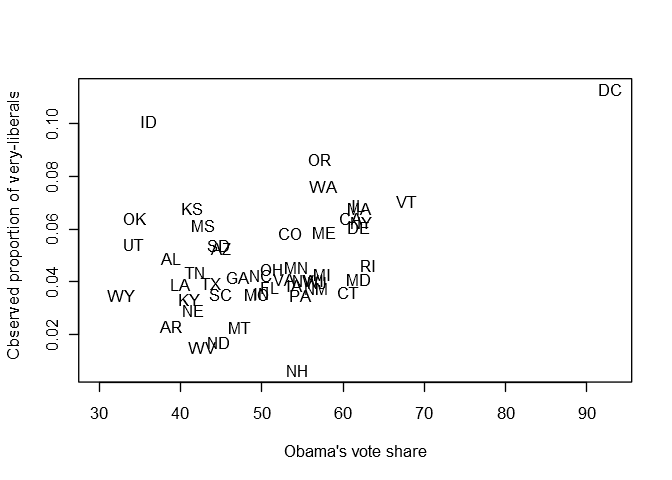<!-- -->

### (b)

``` r
d2 <- merge(estimates, election)
plot(
    proportion ~ vote_Obama_pct,
    data = d2,
    xlim = c(30, 93),
    xlab = "Obama's vote share", ylab = "Bayes-adjusted proportion of very-liberals",
    type = "n"
)
text(x = d2$vote_Obama_pct, y = d2$proportion, labels = d2$stateabbr)
```

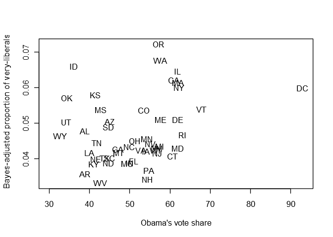<!-- -->

### (c)

``` r
d3 <- merge(d1, d2)
plot(
    very_liberal/total_surveyed ~ total_surveyed,
    data = d3,
    xlab = "Number of respondents", ylab = "Observed proportion of very-liberals",
    type = "n"
)
text(x = d3$total_surveyed, y = d3$very_liberal/d3$total_surveyed, labels = d3$stateabbr)
```

<!-- -->

``` r
plot(
    proportion ~ total_surveyed,
    data = d3,
    xlab = "Number of respondents", ylab = "Bayes-adjusted proportion of very-liberals",
    type = "n"
)
text(x = d3$total_surveyed, y = d3$proportion, labels = d3$stateabbr)
```

<!-- -->

-----

[Antonio R. Vargas](https://github.com/szego)

12 Nov 2018
