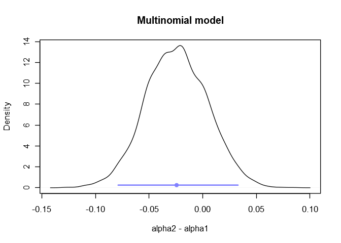
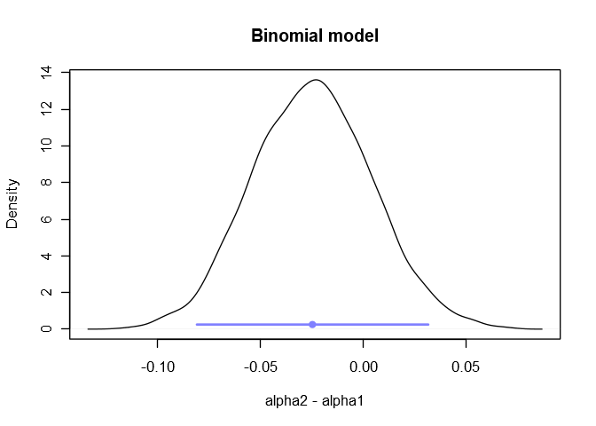
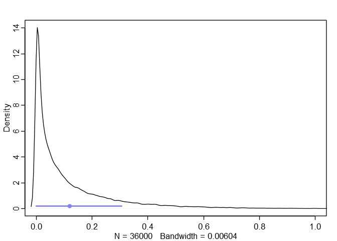
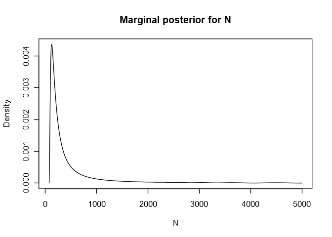
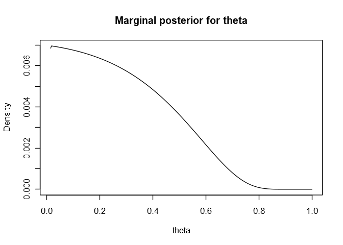
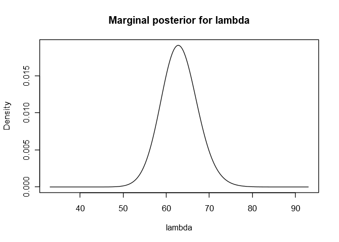
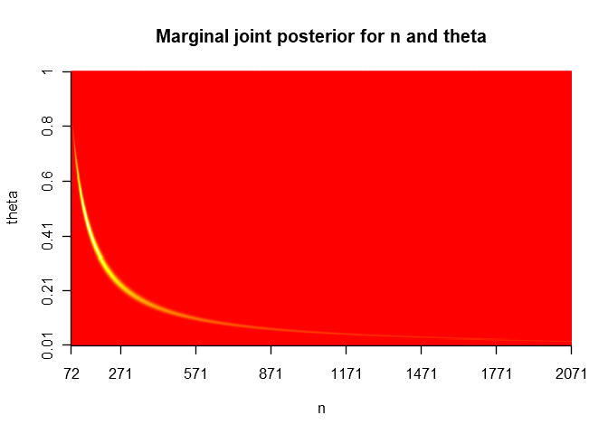
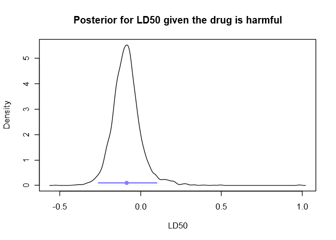
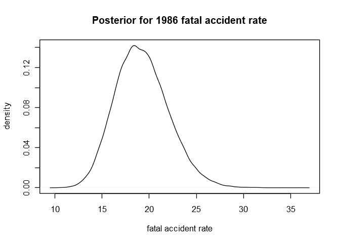
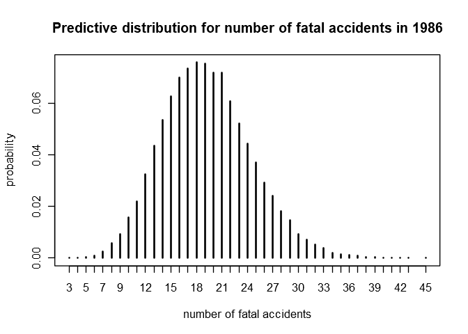

Selected Exercises from Chapter 3
================

The **rethinking** package is useful for exercise 5. Otherwise we’ll use
**brms**.

``` r
library(rethinking)  # https://github.com/rmcelreath/rethinking
library(brms)
library(coda)
```

## 3.2

To illustrate the conclusion of exercise 1 we’ll fit two models, the
first a multinomial model and the second a binomial model, and see that
they produce the same posteriors.

### Multinomial model

``` r
debate <- data.frame(
    surveyed = c(rep(1, 294), rep(2, 307), rep(3, 38), rep(1, 288), rep(2, 332), rep(3, 19)),
    post = c(rep(0, 639), rep(1, 639))
)

m3e_1 <- brm(
    surveyed ~ post,
    family = categorical,
    data = debate
)
```

``` r
summary(m3e_1)
```

    ##  Family: categorical 
    ##   Links: mu2 = logit; mu3 = logit 
    ## Formula: surveyed ~ post 
    ##    Data: debate (Number of observations: 1278) 
    ## Samples: 4 chains, each with iter = 2000; warmup = 1000; thin = 1;
    ##          total post-warmup samples = 4000
    ## 
    ## Population-Level Effects: 
    ##               Estimate Est.Error l-95% CI u-95% CI Eff.Sample Rhat
    ## mu2_Intercept     0.04      0.08    -0.12     0.21       3705 1.00
    ## mu3_Intercept    -2.05      0.17    -2.39    -1.71       5153 1.00
    ## mu2_post          0.10      0.12    -0.13     0.32       3987 1.00
    ## mu3_post         -0.69      0.30    -1.31    -0.11       3144 1.00
    ## 
    ## Samples were drawn using sampling(NUTS). For each parameter, Eff.Sample 
    ## is a crude measure of effective sample size, and Rhat is the potential 
    ## scale reduction factor on split chains (at convergence, Rhat = 1).

``` r
sm <- function(a, b, c) {
    total <- exp(a) + exp(b) + exp(c)
    c(exp(a)/total, exp(b)/total, exp(c)/total)
}

softmax <- Vectorize(sm, vectorize.args = c("a", "b", "c"))

samples <- as.data.frame(m3e_1)

pre_probs <- softmax(
    rep(0, nrow(samples)),
    samples$b_mu2_Intercept,
    samples$b_mu3_Intercept
)
post_probs <- softmax(
    rep(0, nrow(samples)),
    samples$b_mu2_Intercept + samples$b_mu2_post,
    samples$b_mu3_Intercept + samples$b_mu3_post
)

a2_minus_a1 <- post_probs[1,]/(post_probs[1,] + post_probs[2,]) - pre_probs[1,]/(pre_probs[1,] + pre_probs[2,])

mu <- mean(a2_minus_a1)
HDI <- HPDinterval(as.mcmc(a2_minus_a1))[1,]

plot(density(a2_minus_a1), xlab = "alpha2 - alpha1", ylab = "Density", main = "Multinomial model")

points(mu, 0.25, pch = 16, col = rangi2)

lines(HDI, c(0.25, 0.25), col = rangi2, lwd = 2)
```

<!-- -->

``` r
# Posterior probability that there was a shift toward Bush
sum(a2_minus_a1 > 0)/length(a2_minus_a1)
```

    ## [1] 0.20375

### Binomial model

``` r
debate2 <- data.frame(
    bush = c(294, 288),
    total = c(294+307, 288+332),
    post = c(0, 1)
)

m3e_2 <- brm(
    bush | trials(total) ~ post,
    family = binomial,
    data = debate2
)
```

``` r
summary(m3e_2)
```

    ##  Family: binomial 
    ##   Links: mu = logit 
    ## Formula: bush | trials(total) ~ post 
    ##    Data: debate2 (Number of observations: 2) 
    ## Samples: 4 chains, each with iter = 2000; warmup = 1000; thin = 1;
    ##          total post-warmup samples = 4000
    ## 
    ## Population-Level Effects: 
    ##           Estimate Est.Error l-95% CI u-95% CI Eff.Sample Rhat
    ## Intercept    -0.04      0.08    -0.20     0.12       3585 1.00
    ## post         -0.10      0.12    -0.32     0.13       3808 1.00
    ## 
    ## Samples were drawn using sampling(NUTS). For each parameter, Eff.Sample 
    ## is a crude measure of effective sample size, and Rhat is the potential 
    ## scale reduction factor on split chains (at convergence, Rhat = 1).

``` r
samples <- as.data.frame(m3e_2)

bush_pre <- inv_logit_scaled(samples$b_Intercept)
bush_post <- inv_logit_scaled(samples$b_Intercept + samples$b_post)

mu <- mean(bush_post - bush_pre)
HDI <- HPDinterval(as.mcmc(bush_post - bush_pre))[1,]

plot(density(bush_post - bush_pre), xlab = "alpha2 - alpha1", ylab = "Density", main = "Binomial model")

points(mu, 0.25, pch = 16, col = rangi2)

lines(HDI, c(0.25, 0.25), col = rangi2, lwd = 2)
```

<!-- -->

``` r
# Posterior probability that there was a shift toward Bush
sum(bush_post - bush_pre > 0)/length(bush_post - bush_pre)
```

    ## [1] 0.19625

## 3.5

This is a really interesting problem. I recommend reading [this
discussion on Google
Groups](https://groups.google.com/forum/#!topic/stan-users/KIH26xC_3UM)
in which Gelman and others discuss various ways to model this type of
problem using Stan.

I’ll present four different models, some of them more correct than
others, implemented in Stan, **brms**, and **rethinking**. I’ll use the
same priors and data in each model so that we can directly compare their
estimates.

### (b)

As far as I can tell, it isn’t possible to implement the correct model
for this problem (see the [solutions
manual](http://www.stat.columbia.edu/~gelman/book/)) in **brms**. But
here’s Gelman’s Stan code for it, which we can run with **rstan**.

``` r
weights = c(10, 10, 12, 11, 9)
```

``` r
gelman_code <- "
    data {
        int<lower=0> N;
        vector[N] y;
    }
    parameters {
        real mu;
        real<lower=0> sigma;
    }
    model {
        target += normal_lpdf(mu | 10, 5); 
        target += gamma_lpdf(sigma | 2, 1); 
        for (n in 1:N)
            target += log(Phi((y[n] + 0.5 - mu) / sigma) - Phi((y[n] - 0.5 - mu) / sigma));
    }
"

m3e_gelman <- stan(
    model_code = gelman_code,
    data = list(y = weights, N = length(weights)),
    iter = 1e4,
    warmup = 1e3,
    chains = 4
)
```

``` r
print(m3e_gelman)
```

    ## Inference for Stan model: 141e038dedf6be2bc4e878de7bb337ea.
    ## 4 chains, each with iter=10000; warmup=1000; thin=1; 
    ## post-warmup draws per chain=9000, total post-warmup draws=36000.
    ## 
    ##         mean se_mean   sd   2.5%    25%    50%    75%  97.5% n_eff Rhat
    ## mu     10.40    0.01 0.70   9.00  10.00  10.39  10.79  11.81 12640    1
    ## sigma   1.44    0.01 0.61   0.67   1.02   1.30   1.70   3.00 12160    1
    ## lp__  -11.82    0.01 1.13 -14.83 -12.26 -11.47 -11.02 -10.72  9858    1
    ## 
    ## Samples were drawn using NUTS(diag_e) at Mon Nov 19 23:20:12 2018.
    ## For each parameter, n_eff is a crude measure of effective sample size,
    ## and Rhat is the potential scale reduction factor on split chains (at 
    ## convergence, Rhat=1).

We can approximate this result using **brms** by modeling the error on
each measurement as Gaussians with standard deviations fixed at 0.25,
putting 95% of the density within 0.5 of the given integer values.

``` r
m3e_3 <- brm(
    y | se(y_sd, sigma = TRUE) ~ 1,
    prior = prior(normal(10, 5), class = Intercept) + prior(gamma(2, 1), class = sigma),
    data = list(
        y = weights,
        y_sd = rep(0.25, length(weights))
    ),
    control = list(adapt_delta = 0.95),
    iter = 1e4,
    warmup = 1e3
)
```

``` r
summary(m3e_3)
```

    ##  Family: gaussian 
    ##   Links: mu = identity; sigma = identity 
    ## Formula: y | se(y_sd, sigma = TRUE) ~ 1 
    ##    Data: list(y = weights, y_sd = rep(0.25, length(weights) (Number of observations: 5) 
    ## Samples: 4 chains, each with iter = 10000; warmup = 1000; thin = 1;
    ##          total post-warmup samples = 36000
    ## 
    ## Population-Level Effects: 
    ##           Estimate Est.Error l-95% CI u-95% CI Eff.Sample Rhat
    ## Intercept    10.39      0.68     8.99    11.76      13083 1.00
    ## 
    ## Family Specific Parameters: 
    ##       Estimate Est.Error l-95% CI u-95% CI Eff.Sample Rhat
    ## sigma     1.44      0.60     0.69     2.96      12831 1.00
    ## 
    ## Samples were drawn using sampling(NUTS). For each parameter, Eff.Sample 
    ## is a crude measure of effective sample size, and Rhat is the potential 
    ## scale reduction factor on split chains (at convergence, Rhat = 1).

### (d)

The **brms** model doesn’t generate posteriors for the inferred
pre-rounded values.

Gelman provided the following Stan code in the Google Groups discussion
which models the pre-rounded values as latent variables with uniform
priors of width 1 centered at the rounded values.

    data{
      int<lower=0> N;
      vector[N] y;
    }
    parameters {
      real mu;
      real<lower=0> sigma;
      vector[N] z;
    }
    model {
      z ~ uniform(y - 0.5, y + 0.5);
      z ~ normal(mu, sigma);
    }

Because of the unexpected bounds placed on the inferred values by the
uniform priors (Stan expects all parameters which aren’t explicitly
constrained to be unconstrained), the sampling for this model is
extremely inefficient. If we approximate this model by using normal
priors centered at the rounded values instead of uniform priors, there
is no issue with sampling efficiency or divergent transitions and we get
almost exactly the same results. We can actually do this in
**rethinking**.

``` r
m3e_4 <- map2stan(
    alist(
        y_est ~ dnorm(mu, sigma),
        y_est ~ dnorm(y, 0.25),
        mu ~ dnorm(10, 5),
        sigma ~ dgamma(2, 1)
    ),
    data = list(y = weights),
    start = list(y_est = weights),
    control = list(adapt_delta = 0.95),
    iter = 1e4,
    warmup = 1e3,
    chains = 4
)
```

``` r
precis(m3e_4, depth = 2)
```

    ##           Mean StdDev lower 0.89 upper 0.89 n_eff Rhat
    ## y_est[1] 10.02   0.24       9.63      10.40 37589    1
    ## y_est[2] 10.02   0.25       9.61      10.39 36872    1
    ## y_est[3] 11.93   0.25      11.54      12.33 36097    1
    ## y_est[4] 10.98   0.25      10.59      11.37 33257    1
    ## y_est[5]  9.06   0.25       8.66       9.45 34174    1
    ## mu       10.39   0.71       9.31      11.47 18232    1
    ## sigma     1.45   0.60       0.64       2.22 18735    1

The means of these inferred values essentially match the means of
Gelman’s inferred values: 10.02, 10.02, 11.92, 10.96, and 9.07.

Anyway, it’s straightforward to get a posterior for (z1 - z2)^2 from
this last model.

``` r
samples <- extract.samples(m3e_4)
z1_minus_z2_squared <- (samples$y_est[,1] - samples$y_est[,2])^2
mu <- mean(z1_minus_z2_squared)
sigma <- sd(z1_minus_z2_squared)
HDI <- HPDI(z1_minus_z2_squared)

# rethinking::dens()
dens(z1_minus_z2_squared, xlim = c(0, 1))

points(mu, 0.2, pch = 16, col = rangi2)

lines(HDI, c(0.2, 0.2), lwd = 2, col = rangi2)
```

<!-- -->

In table form:

``` r
data.frame(
    mean = round(mu, 3),
    sd = round(sigma, 3),
    HPDI_89 = paste(round(HDI[1], 3), "to", round(HDI[2], 3))
)
```

    ##   mean   sd    HPDI_89
    ## 1 0.12 0.17 0 to 0.306

## 3.6

It’s not possible to run models involving discrete parameters (like N
here) in Stan, so neither **brms** nor **rethinking** can handle this
problem. I’d eventually love to learn how to run this type of model in
BUGS or JAGS, but until that time I’ll have to manage with a grid-based
model.

### (b)

Instead of the uninformative 1/lambda^2 prior suggested by the book,
we’ll put an informative prior on lambda: a gamma prior with mean 63
(the mean of the observations) and scale 1, giving the prior a standard
deviation of about 8. This assumes that lambdas smaller than 48 and
larger than 79 are unlikely. Considering that lambda is the
unconditional mean of the distribution of observations, and that all our
observations are between 53 and 72, this prior for their mean seems
reasonable.

Because we’ll be computing the posterior on a fixed grid we’ll have to
make assumptions about bounds on our parameters. We’ll assume N is
bounded between 72 (the largest observed number of waterbuck) and 5000,
and that lambda is bounded between 33 and 93. We’ll also assume that
theta is bounded between 0.014 and 1; if theta was any closer to 0 then
lambda/theta would end up being \> 5000, our hard bound on the max of N.

``` r
waterbuck <- c(53, 57, 66, 67, 72)

nmin <- max(waterbuck)
nmax <- 5e3

n.seq <- seq(from = nmin, to = nmax)
theta.seq <- seq(from = 0.014, to = 1, length.out = 300)
lambda.seq <- seq(from = 33, to = 93, length.out = 300)

# Add factors in Bayes' formula on the log scale,
# then exponentiate at the end.
posterior <- function(n, theta, lambda) {
    result <- dgamma2(lambda, mu = 63, scale = 1, log = TRUE) + dpois(n, lambda/theta, log = TRUE)
    for (i in 1:length(waterbuck))
        result <- result + dbinom(waterbuck[i], n, theta, log = TRUE)
    return(exp(result))
}

grid <- array(0, c(length(n.seq), length(theta.seq), length(lambda.seq)));

# keep track of the time it takes to compute the grid
start_time <- Sys.time()
for (i in 1:length(n.seq)) for (j in 1:length(theta.seq)) for (k in 1:length(lambda.seq))
    grid[i, j, k] <- posterior(n.seq[i], theta.seq[j], lambda.seq[k])

# standardize the grid
grid <- grid/sum(grid)

# compute marginals
n_marginal <- apply(grid, 1, sum)
theta_marginal <- apply(grid, 2, sum)
lambda_marginal <- apply(grid, 3, sum)

end_time <- Sys.time()

# how long did it take?
end_time - start_time
```

    ## Time difference of 1.341713 hours

``` r
plot(
    nmin:nmax,
    n_marginal,
    type = "l",
    xlab = "N",
    ylab = "Density",
    main = "Marginal posterior for N"
)
```

<!-- -->

``` r
plot(
    theta.seq,
    theta_marginal,
    type = "l",
    xlab = "theta", ylab = "Density",
    main = "Marginal posterior for theta"
)
```

<!-- -->

``` r
plot(
    lambda.seq,
    lambda_marginal,
    type = "l",
    xlab = "lambda", ylab = "Density",
    main = "Marginal posterior for lambda"
)
```

<!-- -->

``` r
n_theta_marginal <- apply(grid, c(1,2), sum)[1:2000,]

image(
    1:nrow(n_theta_marginal),
    1:ncol(n_theta_marginal),
    n_theta_marginal,
    col = heat.colors(60),
    xlab = "n", ylab = "theta",
    main = "Marginal joint posterior for n and theta",
    axes = FALSE
)

axis(1, c(1, 200, 500, 800, 1100, 1400, 1700, 2000), n.seq[c(1, 200, 500, 800, 1100, 1400, 1700, 2000)])

axis(2, c(1, 60, 120, 180, 240, 300), round(theta.seq[c(1, 60, 120, 180, 240, 300)], 2))
```

<!-- -->

The median and 95% highest posterior density interval for
N:

``` r
n_samples <- sample(nmin:nmax, size = 1e5, replace = TRUE, prob = n_marginal)
median(n_samples)
```

    ## [1] 240

``` r
HPDinterval(as.mcmc(n_samples))[1,]
```

    ## lower upper 
    ##    75  1737

The posterior probability that N \> 100:

``` r
sum(n_marginal[nmin:nmax > 100])
```

    ## [1] 0.9608396

### (c)

Using a Poisson with fixed mean as a prior for N would be far too
restrictive. How would we even choose that mean?

## 3.11

### (a)

One thing that makes this particular exercise awkward is that **brms**
does not categorize the intercept as a population-level effect, so we
can’t immediately include it in the multivariate normal prior. We can
get around this by telling **brms** not to use an intercept in the
formula, then creating a new predictor (we’ll call it “intercept”) which
always equals 1. The estimated coefficient on that predictor will be
equal to the original intercept.

``` r
bioa <- list(
    dose = c(-0.86, -0.3, -0.05, 0.73),
    animals = c(5, 5, 5, 5),
    deaths = c(0, 1, 3, 5),
    intercept = rep(1, 4)
)

# mean vector
Mu <- c(0, 10)

# covariance matrix
Sigma <- matrix(c(2, 0, 0, 10), nrow = 2) %*%
    matrix(c(1, 0.5, 0.5, 1), nrow = 2) %*%
    matrix(c(2, 0, 0, 10), nrow = 2)

bprior <- prior(multi_normal(M, V), class = "b")

# MUST use "K" as the dimensions of the mean vector and covariance matrix.
stanvars <- stanvar(Mu, "M", scode = "  vector[K] M;") +
    stanvar(Sigma, "V", scode = "  matrix[K, K] V;")

m3e_5 <- brm(
    deaths | trials(animals) ~ 0 + intercept + dose,  # move alpha into population-level effects
    family = binomial,
    prior = bprior,
    stanvars = stanvars,
    data = bioa
)
```

``` r
summary(m3e_5)
```

    ##  Family: binomial 
    ##   Links: mu = logit 
    ## Formula: deaths | trials(animals) ~ 0 + intercept + dose 
    ##    Data: bioa (Number of observations: 4) 
    ## Samples: 4 chains, each with iter = 2000; warmup = 1000; thin = 1;
    ##          total post-warmup samples = 4000
    ## 
    ## Population-Level Effects: 
    ##           Estimate Est.Error l-95% CI u-95% CI Eff.Sample Rhat
    ## intercept     0.96      0.87    -0.65     2.81       1211 1.00
    ## dose         10.42      4.57     3.27    20.65       1082 1.00
    ## 
    ## Samples were drawn using sampling(NUTS). For each parameter, Eff.Sample 
    ## is a crude measure of effective sample size, and Rhat is the potential 
    ## scale reduction factor on split chains (at convergence, Rhat = 1).

``` r
samples <- as.data.frame(m3e_5)
par(pty = "s")
plot(samples$b_dose ~ samples$b_intercept, col = col.alpha("black", 0.1), xlab = "alpha", ylab = "beta")
```

<!-- -->

The probability that the drug is harmful:

``` r
sum(samples$b_dose > 0)/nrow(samples)
```

    ## [1] 1

``` r
# (all samples had beta > 0)
sum(samples$b_dose > 0)
```

    ## [1] 4000

Here’s the posterior for the LD50, conditional on the drug being harmful
(that is, using samples for which the dose coefficient is positive). We
also show the mean and 95% HPDI in blue.

``` r
harmful_samples <- samples[samples$b_dose > 0,]
ld50 <- -harmful_samples$b_intercept / harmful_samples$b_dose
HPDI <- HPDinterval(as.mcmc(ld50))[1,]

plot(
    density(ld50),
    xlab = "LD50",
    ylab = "Density",
    main = "Posterior for LD50 given the drug is harmful"
)

lines(HPDI, c(0.1, 0.1), lwd = 2, col = rangi2)

points(mean(ld50), 0.1, pch = 16, col = rangi2)
```

<!-- -->

``` r
# mean and HPDI for the LD50
data.frame(
    mean = round(mean(ld50), 2),
    HPDI_95 = paste(round(HPDI[1], 2), "to", round(HPDI[2], 2))
)
```

    ##    mean      HPDI_95
    ## 1 -0.09 -0.26 to 0.1

### (c)

The prior in this exercise basically encodes the assumption that a drug
with a higher death rate at a given dose (1 g/ml in this case) is
expected to kill more animals as the dose is increased.

The effect is that the estimated LD50 and its posterior have shifted
upward a bit.

## 3.12

We’ll just fit regressions with flat priors and compute the predictions
for 1986.

``` r
airlines <- data.frame(
    year = c(1976, 1977, 1978, 1979, 1980, 1981, 1982, 1983, 1984, 1985),
    fatal_accidents = c(24, 25, 31, 31, 22, 21, 26, 20, 16, 22),
    passenger_deaths = c(734, 516, 754, 877, 814, 362, 764, 809, 223, 1066),
    death_rate = c(0.19, 0.12, 0.15, 0.16, 0.14, 0.06, 0.13, 0.13, 0.03, 0.15)
)
airlines$miles <- airlines$passenger_deaths/airlines$death_rate * 1e-3
airlines$year_s <- (airlines$year - mean(airlines$year))/sd(airlines$year)

m3e_6 <- brm(
    fatal_accidents ~ year_s,
    family = poisson,
    data = airlines,
    iter = 1e4,
    warmup = 1e3,
    chains = 4
)
```

``` r
summary(m3e_6)
```

    ##  Family: poisson 
    ##   Links: mu = log 
    ## Formula: fatal_accidents ~ year_s 
    ##    Data: airlines (Number of observations: 10) 
    ## Samples: 4 chains, each with iter = 10000; warmup = 1000; thin = 1;
    ##          total post-warmup samples = 36000
    ## 
    ## Population-Level Effects: 
    ##           Estimate Est.Error l-95% CI u-95% CI Eff.Sample Rhat
    ## Intercept     3.16      0.07     3.03     3.29      28182 1.00
    ## year_s       -0.12      0.07    -0.25     0.02      29242 1.00
    ## 
    ## Samples were drawn using sampling(NUTS). For each parameter, Eff.Sample 
    ## is a crude measure of effective sample size, and Rhat is the potential 
    ## scale reduction factor on split chains (at convergence, Rhat = 1).

``` r
samples <- as.data.frame(m3e_6)

year_s <- (1986 - mean(airlines$year))/sd(airlines$year)
log_accident_rate <- samples$b_Intercept + year_s*samples$b_year_s
accident_rate <- exp(log_accident_rate)

plot(
    density(accident_rate),
    xlab = "fatal accident rate", ylab = "density",
    main = "Posterior for 1986 fatal accident rate"
)
```

<!-- -->

``` r
predictive <- rpois(length(accident_rate), lambda = accident_rate)

plot(
    table(predictive)/length(predictive),
    xlab = "number of fatal accidents", ylab = "probability",
    main = "Predictive distribution for number of fatal accidents in 1986"
)
```

<!-- -->

This predictive distribution yields the following estimate and
corresponding 95% prediction interval.

``` r
interval <- HPDinterval(as.mcmc(predictive))[1,]
data.frame(
    year = 1986,
    fatal_accidents = round(mean(predictive)),
    sd = round(sd(predictive), 2),
    HPDI_95 = paste(interval[1], "to", interval[2])
)
```

    ##   year fatal_accidents   sd HPDI_95
    ## 1 1986              19 5.22 9 to 29

Because the yearly rates were not shrunk using a multilevel model, this
model ended up overestimating the magnitude of the coefficient on
`year_s`, and ended up underestimating the true number of fatal
accidents in 1986. It did capture the true number in its 95% predictive
interval, though. Compare with model `m2e_13_3` from the chapter 2
exercises.

Just to check, let’s see what happens when we include an exposure in the
model proportional to the number of passenger miles flown.

``` r
m3e_7 <- brm(
    fatal_accidents ~ year_s + offset(log(miles)),
    family = poisson,
    data = airlines,
    iter = 1e4,
    warmup = 1e3,
    chains = 4
)
```

``` r
summary(m3e_7)
```

    ##  Family: poisson 
    ##   Links: mu = log 
    ## Formula: fatal_accidents ~ year_s + offset(log(miles)) 
    ##    Data: airlines (Number of observations: 10) 
    ## Samples: 4 chains, each with iter = 10000; warmup = 1000; thin = 1;
    ##          total post-warmup samples = 36000
    ## 
    ## Population-Level Effects: 
    ##           Estimate Est.Error l-95% CI u-95% CI Eff.Sample Rhat
    ## Intercept     1.43      0.07     1.30     1.56      29881 1.00
    ## year_s       -0.32      0.07    -0.45    -0.18      28577 1.00
    ## 
    ## Samples were drawn using sampling(NUTS). For each parameter, Eff.Sample 
    ## is a crude measure of effective sample size, and Rhat is the potential 
    ## scale reduction factor on split chains (at convergence, Rhat = 1).

``` r
loo(m3e_6, m3e_7)
```

    ##               LOOIC   SE
    ## m3e_6         59.09 2.03
    ## m3e_7         59.11 1.86
    ## m3e_6 - m3e_7 -0.02 1.81

According to LOOIC, this model has almost exactly the same predictive
power as the last model. We could check (I did) that it yields basically
the same estimate and predictive interval for 1986.

-----

[Antonio R. Vargas](https://github.com/szego)

19 Nov 2018
