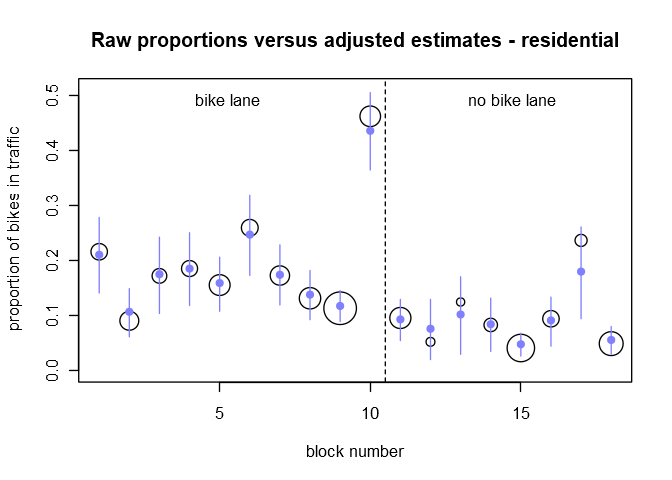
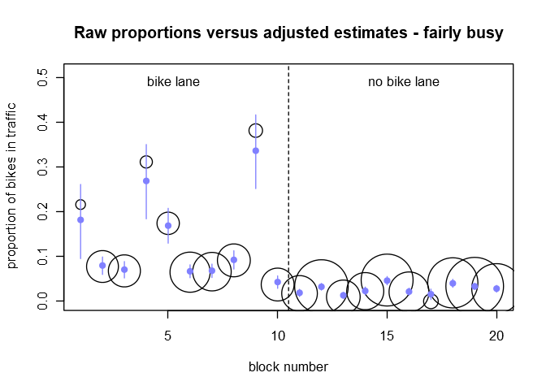
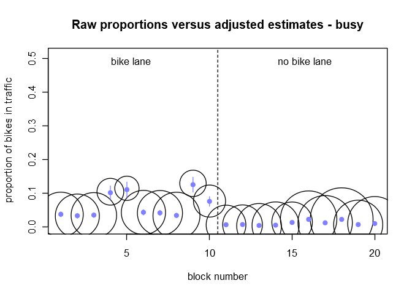
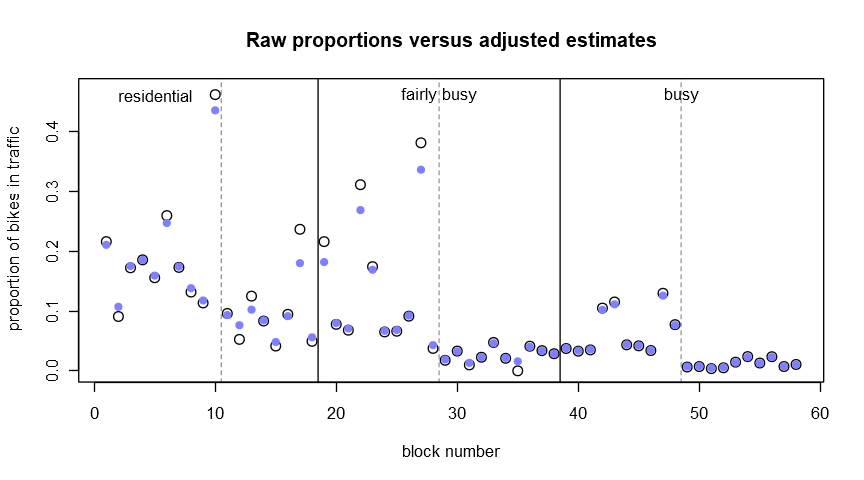
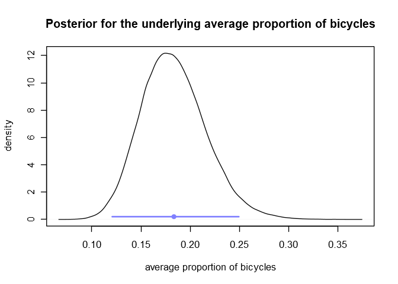
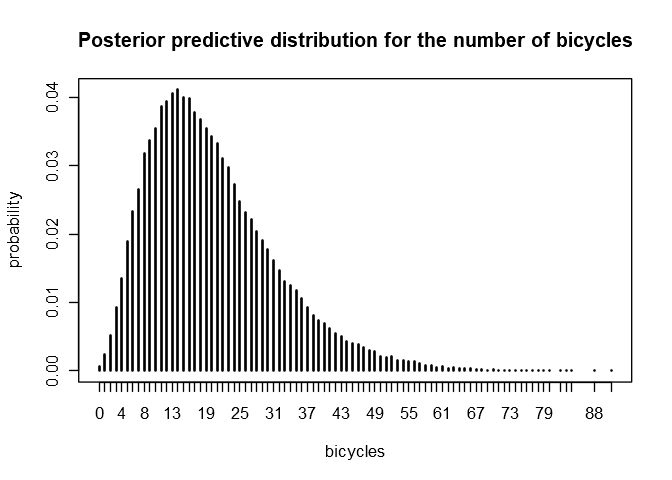
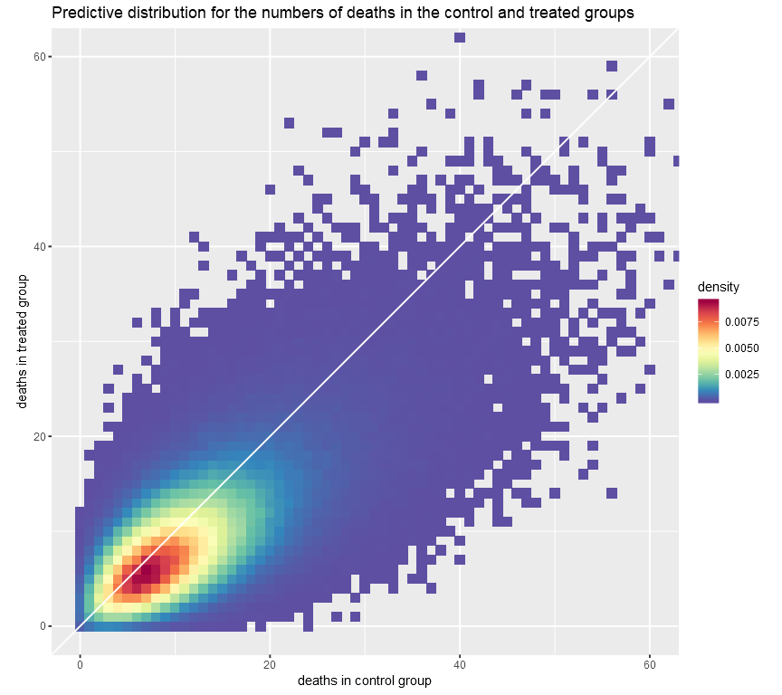

Selected Exercises from Chapter 5
================

Libraries and helper functions we’ll need:

``` r
library(brms)
library(coda)
library(ggplot2)
library(RColorBrewer)

# The following helper functions are from the 'rethinking' package.
# https://github.com/rmcelreath/rethinking

col.alpha <- function( acol , alpha=0.2 ) {
    acol <- col2rgb(acol)
    acol <- rgb(acol[1]/255,acol[2]/255,acol[3]/255,alpha)
    acol
}

col.desat <- function( acol , amt=0.5 ) {
    acol <- col2rgb(acol)
    ahsv <- rgb2hsv(acol)
    ahsv[2] <- ahsv[2] * amt
    hsv( ahsv[1] , ahsv[2] , ahsv[3] )
}

rangi2 <- col.desat("blue", 0.5)
```

# 5.13

Here is the complete dataset from Table 3.3 in the book. A `street_type`
of `1` corresponds to “residential” streets, `2` corresponds to “fairly
busy” streets, and `3` corresponds to “busy” streets.

``` r
bike_data <- data.frame(
    bikes = as.integer(c(16, 9, 10, 13, 19, 20, 18, 17, 35, 55, 12, 1, 2, 4, 9, 7, 9, 8, 8, 35, 31, 19,
                         38, 47, 44, 44, 29, 18, 10, 43, 5, 14, 58, 15, 0, 47, 51, 32, 60, 51, 58, 59,
                         53, 68, 68, 60, 71, 63, 8, 9, 6, 9, 19, 61, 31, 75, 14, 25)),
    other = as.integer(c(58, 90, 48, 57, 103, 57, 86, 112, 273, 64, 113, 18, 14, 44, 208, 67, 29, 154,
                         29, 415, 425, 42, 180, 675, 620, 437, 47, 462, 557, 1258, 499, 601, 1163, 700,
                         90, 1093, 1459, 1086, 1545, 1499, 1598, 503, 407, 1494, 1558, 1706, 476, 752,
                         1248, 1246, 1596, 1765, 1290, 2498, 2346, 3101, 1918, 2318)),
    street_type = as.factor(c(rep(1, 18), rep(2, 20), rep(3, 20))),
    bike_route = as.integer(c(rep(1, 10), rep(0, 8), rep(1, 10), rep(0, 10), rep(1, 10), rep(0, 10)))
)
bike_data$total <- bike_data$bikes + bike_data$other
bike_data$block_id <- 1:nrow(bike_data)
bike_data
```

    ##    bikes other street_type bike_route total block_id
    ## 1     16    58           1          1    74        1
    ## 2      9    90           1          1    99        2
    ## 3     10    48           1          1    58        3
    ## 4     13    57           1          1    70        4
    ## 5     19   103           1          1   122        5
    ## 6     20    57           1          1    77        6
    ## 7     18    86           1          1   104        7
    ## 8     17   112           1          1   129        8
    ## 9     35   273           1          1   308        9
    ## 10    55    64           1          1   119       10
    ## 11    12   113           1          0   125       11
    ## 12     1    18           1          0    19       12
    ## 13     2    14           1          0    16       13
    ## 14     4    44           1          0    48       14
    ## 15     9   208           1          0   217       15
    ## 16     7    67           1          0    74       16
    ## 17     9    29           1          0    38       17
    ## 18     8   154           1          0   162       18
    ## 19     8    29           2          1    37       19
    ## 20    35   415           2          1   450       20
    ## 21    31   425           2          1   456       21
    ## 22    19    42           2          1    61       22
    ## 23    38   180           2          1   218       23
    ## 24    47   675           2          1   722       24
    ## 25    44   620           2          1   664       25
    ## 26    44   437           2          1   481       26
    ## 27    29    47           2          1    76       27
    ## 28    18   462           2          1   480       28
    ## 29    10   557           2          0   567       29
    ## 30    43  1258           2          0  1301       30
    ## 31     5   499           2          0   504       31
    ## 32    14   601           2          0   615       32
    ## 33    58  1163           2          0  1221       33
    ## 34    15   700           2          0   715       34
    ## 35     0    90           2          0    90       35
    ## 36    47  1093           2          0  1140       36
    ## 37    51  1459           2          0  1510       37
    ## 38    32  1086           2          0  1118       38
    ## 39    60  1545           3          1  1605       39
    ## 40    51  1499           3          1  1550       40
    ## 41    58  1598           3          1  1656       41
    ## 42    59   503           3          1   562       42
    ## 43    53   407           3          1   460       43
    ## 44    68  1494           3          1  1562       44
    ## 45    68  1558           3          1  1626       45
    ## 46    60  1706           3          1  1766       46
    ## 47    71   476           3          1   547       47
    ## 48    63   752           3          1   815       48
    ## 49     8  1248           3          0  1256       49
    ## 50     9  1246           3          0  1255       50
    ## 51     6  1596           3          0  1602       51
    ## 52     9  1765           3          0  1774       52
    ## 53    19  1290           3          0  1309       53
    ## 54    61  2498           3          0  2559       54
    ## 55    31  2346           3          0  2377       55
    ## 56    75  3101           3          0  3176       56
    ## 57    14  1918           3          0  1932       57
    ## 58    25  2318           3          0  2343       58

I’d like to incorporate the full dataset into a model instead of
restricting my attention to just the observations on residential bike
routes as the book suggests. After controlling for the main and
interacting effects of street type and bike route, all of the
observations can share information.

``` r
m5e_1 <- brm(
    bikes | trials(total) ~ (1 | block_id) + street_type*bike_route,
    family = binomial,
    data = bike_data,
    iter = 3e4,
    warmup = 2e3,
    chains = 4,
    cores = 4
)
```

``` r
summary(m5e_1)
```

    ##  Family: binomial 
    ##   Links: mu = logit 
    ## Formula: bikes | trials(total) ~ (1 | block_id) + street_type * bike_route 
    ##    Data: bike_data (Number of observations: 58) 
    ## Samples: 4 chains, each with iter = 30000; warmup = 2000; thin = 1;
    ##          total post-warmup samples = 112000
    ## 
    ## Group-Level Effects: 
    ## ~block_id (Number of levels: 58) 
    ##               Estimate Est.Error l-95% CI u-95% CI Eff.Sample Rhat
    ## sd(Intercept)     0.64      0.08     0.51     0.81      27663 1.00
    ## 
    ## Population-Level Effects: 
    ##                         Estimate Est.Error l-95% CI u-95% CI Eff.Sample
    ## Intercept                  -2.43      0.29    -2.99    -1.87      36596
    ## street_type2               -1.25      0.37    -1.97    -0.54      31678
    ## street_type3               -2.17      0.36    -2.89    -1.46      32496
    ## bike_route                  0.92      0.36     0.21     1.63      32347
    ## street_type2:bike_route     0.70      0.47    -0.23     1.64      29579
    ## street_type3:bike_route     0.86      0.47    -0.06     1.80      28334
    ##                         Rhat
    ## Intercept               1.00
    ## street_type2            1.00
    ## street_type3            1.00
    ## bike_route              1.00
    ## street_type2:bike_route 1.00
    ## street_type3:bike_route 1.00
    ## 
    ## Samples were drawn using sampling(NUTS). For each parameter, Eff.Sample 
    ## is a crude measure of effective sample size, and Rhat is the potential 
    ## scale reduction factor on split chains (at convergence, Rhat = 1).

The positive coefficients on the interaction terms tell us that the
proportions of bike traffic on fairly busy and busy streets are more
sensitive to the presence of a bike route than the proportions on
residential streets (after controlling for the main effects of street
type). I’m not sure what constitutes a “bike route” in this data, but
this could reflect cyclists avoiding streets where they are likely to be
forced to interact with motor vehicles.

## 5.13 (c)

Below we’ll make a series of plots comparing the raw proportions, drawn
as circles whose area is proportional to the sample size, to the
adjusted estimates, drawn as solid blue dots. We’ll also draw 89%
probability intervals as blue lines through each estimate.

``` r
samples <- as.data.frame(m5e_1)
logit_block <- sapply(1:58, function(i) samples$b_Intercept + samples[,7 + i])

logit_residential <- sapply(
    1:18,
    function(i) logit_block[,i] + (if(i <= 10) samples$b_bike_route else 0)
)
residential <- inv_logit_scaled(logit_residential)
residential_mu <- apply(residential, 2, mean)
residential_PI <- apply(residential, 2, function(x) HPDinterval(as.mcmc(x), prob = 0.89)[1,])
raw_residential <- bike_data$bikes[1:18]/bike_data$total[1:18]

ymax = 0.51
plot(
    1:18, raw_residential,
    cex = 0.25*sqrt(bike_data$total[1:18]),
    ylim = c(0, ymax),
    xlab = "block number", ylab = "proportion of bikes in traffic",
    main = "Raw proportions versus adjusted estimates - residential"
)
points(1:18, residential_mu, pch = 16, col = rangi2)
for(i in 1:18)
    lines(c(i, i), residential_PI[,i], col = rangi2)
lines(c(10.5, 10.5), c(-0.02, ymax + 0.02), lty = 2)
text(5.25, ymax - 0.02, "bike lane")
text(14.7, ymax - 0.02, "no bike lane")
```

<!-- -->

``` r
logit_fairlybusy <- sapply(
    19:38,
    function(i) logit_block[,i] + samples$b_street_type2 +
        (if(i <= 28) samples$b_bike_route + samples$b_street_type2.bike_route else 0)
)
fairlybusy <- inv_logit_scaled(logit_fairlybusy)
fairlybusy_mu <- apply(fairlybusy, 2, mean)
fairlybusy_PI <- apply(fairlybusy, 2, function(x) HPDinterval(as.mcmc(x), prob = 0.89)[1,])
raw_fairlybusy <- bike_data$bikes[19:38]/bike_data$total[19:38]

plot(
    1:20, raw_fairlybusy,
    cex = 0.25*sqrt(bike_data$total[19:38]),
    ylim = c(0, ymax),
    xlab = "block number", ylab = "proportion of bikes in traffic",
    main = "Raw proportions versus adjusted estimates - fairly busy"
)
points(1:20, fairlybusy_mu, pch = 16, col = rangi2)
for(i in 1:20)
    lines(c(i, i), fairlybusy_PI[,i], col = rangi2)
lines(c(10.5, 10.5), c(-0.02, ymax + 0.02), lty = 2)
text(5.25, ymax - 0.02, "bike lane")
text(15.75, ymax - 0.02, "no bike lane")
```

<!-- -->

``` r
logit_busy <- sapply(
    39:58,
    function(i) logit_block[,i] + samples$b_street_type3 +
        (if(i <= 48) samples$b_bike_route + samples$b_street_type3.bike_route else 0)
)
busy <- inv_logit_scaled(logit_busy)
busy_mu <- apply(busy, 2, mean)
busy_PI <- apply(busy, 2, function(x) HPDinterval(as.mcmc(x), prob = 0.89)[1,])
raw_busy <- bike_data$bikes[39:58]/bike_data$total[39:58]

plot(
    1:20, raw_busy,
    cex = 0.25*sqrt(bike_data$total[39:58]),
    ylim = c(0, ymax),
    xlab = "block number", ylab = "proportion of bikes in traffic",
    main = "Raw proportions versus adjusted estimates - busy"
)
points(1:20, busy_mu, pch = 16, col = rangi2)
for(i in 1:20)
    lines(c(i, i), busy_PI[,i], col = rangi2)
lines(c(10.5, 10.5), c(-0.02, ymax + 0.02), lty = 2)
text(5.25, ymax - 0.02, "bike lane")
text(15.75, ymax - 0.02, "no bike lane")
```

<!-- -->

We can see in these plots that the estimates are pulled toward each
other, and that those corresponding to smaller sample sizes are pulled
less. Let’s plot all three of these on the same axis to summarize.

``` r
plot(
    1:58, c(raw_residential, raw_fairlybusy, raw_busy),
    cex = 1.2,
    ylim = c(0, 0.47),
    xlab = "block number", ylab = "proportion of bikes in traffic",
    main = "Raw proportions versus adjusted estimates",
)
points(1:58, c(residential_mu, fairlybusy_mu, busy_mu), pch = 16, col = rangi2)
lines(c(18.5, 18.5), c(-0.02, 0.49))
lines(c(38.5, 38.5), c(-0.02, 0.49))
lines(c(10.5, 10.5), c(-0.02, 0.49), lty = 2, col = col.alpha("black", 0.4))
lines(c(28.5, 28.5), c(-0.02, 0.49), lty = 2, col = col.alpha("black", 0.4))
lines(c(48.5, 48.5), c(-0.02, 0.49), lty = 2, col = col.alpha("black", 0.4))
text(5, 0.46, "residential")
text(28.5, 0.46, "fairly busy")
text(48.5, 0.46, "busy")
```

<!-- -->

Note that we’ve omitted the probability intervals and the information on
sample sizes.

## 5.13 (d)

The way that the model is parameterized, the intercept corresponds to
the average proportion of bicycles on residential streets that aren’t
labeled bike routes. So we just need to add the main coefficient on
`bike_route` to get the average proportion on residential streets
labeled bike
routes.

``` r
logit_avg_prop <- samples$b_Intercept + samples$b_bike_route  # residential & bike route
avg_prop <- inv_logit_scaled(logit_avg_prop)
avg_prop_mu <- mean(avg_prop)
avg_prop_PI <- HPDinterval(as.mcmc(avg_prop))[1,]

plot(
    density(avg_prop),
    xlab = "average proportion of bicycles", ylab = "density",
    main = "Posterior for the underlying average proportion of bicycles"
)

points(avg_prop_mu, 0.2, col = rangi2, pch = 16)

lines(avg_prop_PI, c(0.2, 0.2), lwd = 2, col = rangi2)
```

<!-- -->

``` r
s <- data.frame(
    mean = round(avg_prop_mu, 3),
    sd = round(sd(avg_prop), 3),
    HPDI_95 = paste(round(avg_prop_PI[1], 2), "to", round(avg_prop_PI[2], 2))
)
rownames(s) <- c("average proportion of bicycles")
s
```

    ##                                 mean    sd      HPDI_95
    ## average proportion of bicycles 0.183 0.033 0.12 to 0.25

## 5.13 (e)

We calculate the posterior predictive distribution **p** for the
proportion of bicycles on a residential street labeled a bike route by
averaging over the hyperparameters of the adaptive normal prior. The
predictive distribution for the number of bicycles is then the expected
value of the average binomial distribution

**predictive(k | n = 100) = E\[Binomial(k | n = 100, p)\].**

``` r
logit_p <- rnorm(
    nrow(samples),
    mean = logit_avg_prop,
    sd = samples$sd_block_id__Intercept
)
p <- inv_logit_scaled(logit_p)

predictive <- rbinom(nrow(samples), size = 100, prob = p)

plot(
    table(predictive)/length(predictive),
    xlab = "bicycles", ylab = "probability",
    main = "Posterior predictive distribution for the number of bicycles"
)
```

<!-- -->

``` r
predictive_PI <- HPDinterval(as.mcmc(predictive))[1,]
s <- data.frame(
    median = median(predictive),
    sd = round(sd(predictive), 1),
    HPDI_95 = paste(predictive_PI[1], "to", predictive_PI[2])
)
rownames(s) <- c("new city block prediction")
s
```

    ##                           median   sd HPDI_95
    ## new city block prediction     18 11.3 2 to 42

I suppose I would trust this interval less if the conditions under which
the new street is observed (e.g. time of day, day of week, season)
differ from those under which the data were observed.

# 5.15

The data for this example is available from [Gelman’s
website](http://www.stat.columbia.edu/~gelman/book/data/).

``` r
metatext <- readChar("meta.asc", file.info("meta.asc")$size)
# skip the preamble
metatext <- substr(metatext, regexpr("\n\n", metatext) + 2, nchar(metatext))
# remove leading and trailing spaces around newlines
metatext <- gsub("\n ", "\n", metatext)
metatext <- gsub(" \n", "\n", metatext)
# replace repeated spaces with tabs
metatext <- gsub(" +", "\t", metatext)
# read the tab-delimited data into a data frame
meta <- read.delim(text = metatext)
```

We formulated the following bivariate binomial model for this data [in
our notes on this
chapter](https://github.com/szego/BDA-singalong/blob/master/ch05.md#a-multivariate-binomial-model).

``` r
f1 <- bf(cdeaths | trials(ctotal) ~ (1 |p| study))
f2 <- bf(tdeaths | trials(ttotal) ~ (1 |p| study))

m5e_2 <- brm(
    mvbf(f1, f2),
    family = binomial,
    data = list(
        cdeaths = meta$control.deaths,
        ctotal = meta$control.total,
        tdeaths = meta$treated.deaths,
        ttotal = meta$treated.total,
        study = meta$study
    ),
    iter = 1e5,
    warmup = 3e3,
    chains = 4,
    cores = 4,
    control = list(adapt_delta = 0.95)
)
```

``` r
summary(m5e_2)
```

    ##  Family: MV(binomial, binomial) 
    ##   Links: mu = logit
    ##          mu = logit 
    ## Formula: cdeaths | trials(ctotal) ~ (1 | p | study) 
    ##          tdeaths | trials(ttotal) ~ (1 | p | study) 
    ##    Data: list(cdeaths = meta$control.deaths, ctotal = meta$ (Number of observations: 22) 
    ## Samples: 4 chains, each with iter = 1e+05; warmup = 3000; thin = 1;
    ##          total post-warmup samples = 388000
    ## 
    ## Group-Level Effects: 
    ## ~study (Number of levels: 22) 
    ##                                          Estimate Est.Error l-95% CI
    ## sd(cdeaths_Intercept)                        0.54      0.11     0.37
    ## sd(tdeaths_Intercept)                        0.51      0.10     0.35
    ## cor(cdeaths_Intercept,tdeaths_Intercept)     0.92      0.07     0.73
    ##                                          u-95% CI Eff.Sample Rhat
    ## sd(cdeaths_Intercept)                        0.78     111743 1.00
    ## sd(tdeaths_Intercept)                        0.75     129015 1.00
    ## cor(cdeaths_Intercept,tdeaths_Intercept)     1.00     174161 1.00
    ## 
    ## Population-Level Effects: 
    ##                   Estimate Est.Error l-95% CI u-95% CI Eff.Sample Rhat
    ## cdeaths_Intercept    -2.21      0.13    -2.47    -1.96      71555 1.00
    ## tdeaths_Intercept    -2.45      0.12    -2.70    -2.21      81102 1.00
    ## 
    ## Samples were drawn using sampling(NUTS). For each parameter, Eff.Sample 
    ## is a crude measure of effective sample size, and Rhat is the potential 
    ## scale reduction factor on split chains (at convergence, Rhat = 1).

We’ll just focus on part (e) of this exercise.

## 5.15 (e)

The strength of our model is that we can simulate the control and
treated deaths directly. First we sample from the bivariate normal
distribution of logit-probabilities.

``` r
samples <- as.data.frame(m5e_2)
logit_probs <- sapply(
    1:nrow(samples),
    function(i) {
        Mu <- c(samples$b_cdeaths_Intercept[i], samples$b_tdeaths_Intercept[i])
        DS <- diag(c(samples$sd_study__cdeaths_Intercept[i], samples$sd_study__tdeaths_Intercept[i]))
        Rho <- matrix(c(1, rep(samples$cor_study__cdeaths_Intercept__tdeaths_Intercept[i], 2), 1), nrow = 2)
        Sigma <- DS %*% Rho %*% DS
        MASS::mvrnorm(1, Mu, Sigma)
    }
)
probs <- inv_logit_scaled(logit_probs)
```

Then we use these probabilities to simulate the binomial outcomes in
control groups and treated groups with 100 patients each.

``` r
control <- rbinom(nrow(samples), size = 100, prob = probs[1,])
treated <- rbinom(nrow(samples), size = 100, prob = probs[2,])

df <- data.frame(x = control, y = treated)
rf <- colorRampPalette(rev(brewer.pal(11, "Spectral")))
r <- rf(32)
ggplot(df, aes(x,y)) +
    stat_bin2d(binwidth = 1, origin = -0.5, aes(fill = ..density..)) +
    scale_fill_gradientn(name='density', colors = r) +
    geom_abline(intercept = 0, slope = 1, color = "white") +
    labs(
        x = "deaths in control group",
        y = "deaths in treated group",
        title = "Predictive distribution for the numbers of deaths in the control and treated groups"
    ) +
    coord_fixed(xlim = c(0, 60), ylim = c(0, 60))
```

<!-- -->

Here the white diagonal line corresponds to equal numbers of deaths in
both groups.

The estimated probability that more patients will die in the treated
group than in the control group is

``` r
sum(treated > control)/length(treated)
```

    ## [1] 0.2847268

Note that this is different from *the probability that the chance of
dying in the treated group is higher than the chance of dying in the
control group*, which is

``` r
sum(probs[2,] > probs[1,])/length(probs[2,])
```

    ## [1] 0.1311186

If this seems strange, consider an example where the chance of dying in
the treated group (0.09, say) is surely lower than the chance of dying
in the control group (0.11, say). There’s still a non-negligible
probability that more patients die in the treated group:

``` r
control_fake <- rbinom(1e6, size = 100, prob = 0.11)
treated_fake <- rbinom(1e6, size = 100, prob = 0.09)
sum(treated_fake > control_fake)/length(treated_fake)
```

    ## [1] 0.27645

-----

[Antonio R. Vargas](https://github.com/szego)

9 Dec 2018
